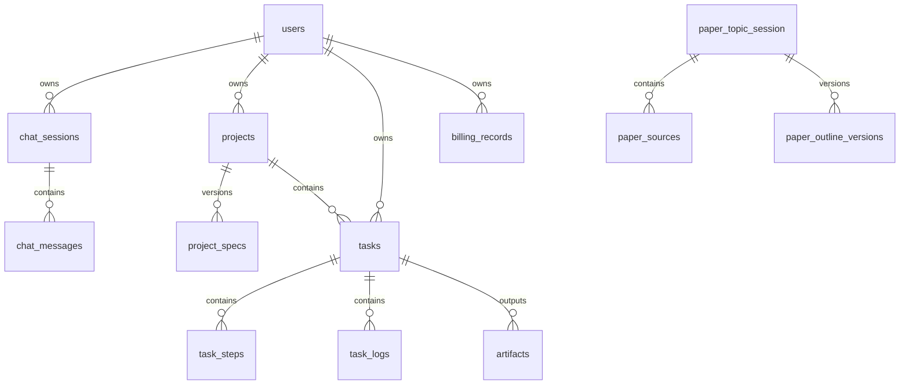

# Smart Code Ark 数据字典

更新时间：2026-03-20

说明：本文档基于 Flyway migration、JPA Entity 和业务代码整理。

## 1. 核心实体关系

## 2. 表级数据字典

### `users`

| 字段 | 类型 | 说明 |
| --- | --- | --- |
| `id` | BIGINT | 用户主键 |
| `username` | VARCHAR(64) | 用户名，唯一 |
| `password_hash` | VARCHAR(255) | 密码哈希 |
| `role` | VARCHAR(32) | 角色，默认 `user` |
| `balance` | DECIMAL(10,2) | 余额 |
| `quota` | INT | 可用额度 |
| `created_at` | DATETIME | 创建时间 |
| `updated_at` | DATETIME | 更新时间 |

### `chat_sessions`

| 字段 | 类型 | 说明 |
| --- | --- | --- |
| `id` | VARCHAR(64) | 会话 ID |
| `user_id` | BIGINT | 用户 ID |
| `project_id` | VARCHAR(64) | 关联项目 ID，可空 |
| `title` | VARCHAR(128) | 会话标题/项目标题 |
| `project_type` | VARCHAR(32) | 项目类型 |
| `description` | VARCHAR(1000) | 初始描述 |
| `status` | VARCHAR(32) | 状态，如 `active/confirmed` |
| `created_at` | DATETIME | 创建时间 |
| `updated_at` | DATETIME | 更新时间 |

### `chat_messages`

| 字段 | 类型 | 说明 |
| --- | --- | --- |
| `id` | BIGINT | 主键 |
| `session_id` | VARCHAR(64) | 所属会话 |
| `speaker` | VARCHAR(16) | `user/assistant` |
| `message` | TEXT | 消息内容 |
| `token_used` | INT | token 消耗估算 |
| `created_at` | DATETIME | 创建时间 |

### `projects`

| 字段 | 类型 | 说明 |
| --- | --- | --- |
| `id` | VARCHAR(64) | 项目 ID |
| `user_id` | BIGINT | 用户 ID |
| `title` | VARCHAR(128) | 项目标题 |
| `description` | VARCHAR(1000) | 项目描述 |
| `project_type` | VARCHAR(32) | 项目类型 |
| `stack_backend` | VARCHAR(32) | 后端技术栈 |
| `stack_frontend` | VARCHAR(32) | 前端技术栈 |
| `stack_db` | VARCHAR(32) | 数据库技术栈 |
| `status` | VARCHAR(32) | 当前主要为 `confirmed` |
| `created_at` | DATETIME | 创建时间 |
| `updated_at` | DATETIME | 更新时间 |

### `project_specs`

| 字段 | 类型 | 说明 |
| --- | --- | --- |
| `id` | BIGINT | 主键 |
| `project_id` | VARCHAR(64) | 项目 ID |
| `version` | INT | 规格版本号 |
| `requirement_json` | JSON | 需求快照 |
| `domain_json` | JSON | 领域模型，当前未实际填充 |
| `api_contract_json` | JSON | 接口契约，当前未实际填充 |
| `created_at` | DATETIME | 创建时间 |

### `tasks`

| 字段 | 类型 | 说明 |
| --- | --- | --- |
| `id` | VARCHAR(64) | 任务 ID |
| `project_id` | VARCHAR(64) | 项目 ID |
| `user_id` | BIGINT | 用户 ID |
| `task_type` | VARCHAR(32) | `generate/modify/paper_outline` |
| `instructions` | TEXT | 补充指令或论文任务 JSON |
| `status` | VARCHAR(32) | `queued/running/finished/failed/cancelled` |
| `progress` | INT | 0-100 |
| `current_step` | VARCHAR(64) | 当前步骤编码 |
| `error_code` | VARCHAR(16) | 错误码 |
| `error_message` | VARCHAR(255) | 错误信息 |
| `result_url` | VARCHAR(512) | 结果地址 |
| `created_at` | DATETIME | 创建时间 |
| `updated_at` | DATETIME | 更新时间 |

### `task_steps`

| 字段 | 类型 | 说明 |
| --- | --- | --- |
| `id` | BIGINT | 主键 |
| `task_id` | VARCHAR(64) | 所属任务 |
| `step_code` | VARCHAR(64) | 步骤编码 |
| `step_name` | VARCHAR(128) | 步骤名称 |
| `step_order` | INT | 步骤顺序 |
| `status` | VARCHAR(32) | `pending/running/finished/failed` |
| `progress` | INT | 步骤进度 |
| `started_at` | DATETIME | 开始时间 |
| `finished_at` | DATETIME | 完成时间 |
| `error_code` | VARCHAR(16) | 错误码 |
| `error_message` | VARCHAR(255) | 错误信息 |
| `retry_count` | INT | 重试次数 |
| `created_at` | DATETIME | 创建时间 |
| `updated_at` | DATETIME | 更新时间 |

### `task_logs`

| 字段 | 类型 | 说明 |
| --- | --- | --- |
| `id` | BIGINT | 主键 |
| `task_id` | VARCHAR(64) | 任务 ID |
| `level` | VARCHAR(16) | `info/warn/error` |
| `content` | TEXT | 日志内容 |
| `created_at` | DATETIME | 创建时间 |

### `artifacts`

| 字段 | 类型 | 说明 |
| --- | --- | --- |
| `id` | BIGINT | 主键 |
| `task_id` | VARCHAR(64) | 任务 ID |
| `project_id` | VARCHAR(64) | 项目 ID |
| `artifact_type` | VARCHAR(32) | 产物类型，如 `zip` |
| `storage_url` | VARCHAR(512) | 存储地址 |
| `size_bytes` | BIGINT | 文件大小 |
| `created_at` | DATETIME | 创建时间 |

### `billing_records`

| 字段 | 类型 | 说明 |
| --- | --- | --- |
| `id` | BIGINT | 主键 |
| `user_id` | BIGINT | 用户 ID |
| `project_id` | VARCHAR(64) | 项目 ID |
| `task_id` | VARCHAR(64) | 任务 ID |
| `change_amount` | DECIMAL(10,2) | 变动值 |
| `currency` | VARCHAR(8) | 当前代码扣减使用 `QUOTA` |
| `reason` | VARCHAR(64) | 变动原因 |
| `balance_after` | DECIMAL(10,2) | 变动后余额/额度快照 |
| `created_at` | DATETIME | 创建时间 |

### `prompt_templates`

| 字段 | 类型 | 说明 |
| --- | --- | --- |
| `id` | BIGINT | 主键 |
| `template_key` | VARCHAR(64) | 模板唯一键 |
| `name` | VARCHAR(128) | 模板名称 |
| `scene` | VARCHAR(64) | 业务场景 |
| `description` | VARCHAR(512) | 描述 |
| `status` | VARCHAR(32) | 状态 |
| `default_version_no` | INT | 默认版本 |
| `cache_enabled` | TINYINT(1) | 是否启用缓存 |
| `cache_ttl_seconds` | INT | 缓存 TTL |
| `created_by` | BIGINT | 创建人 |
| `created_at` | DATETIME | 创建时间 |
| `updated_at` | DATETIME | 更新时间 |

### `prompt_versions`

| 字段 | 类型 | 说明 |
| --- | --- | --- |
| `id` | BIGINT | 主键 |
| `template_id` | BIGINT | 模板 ID |
| `version_no` | INT | 版本号 |
| `system_prompt` | TEXT | 系统提示词 |
| `user_prompt` | TEXT | 用户提示词 |
| `output_schema_json` | JSON | 输出结构 |
| `model` | VARCHAR(64) | 使用模型 |
| `temperature` | DECIMAL(3,2) | 温度 |
| `top_p` | DECIMAL(3,2) | Top P |
| `status` | VARCHAR(32) | 状态 |
| `published_by` | BIGINT | 发布人 |
| `published_at` | DATETIME | 发布时间 |
| `created_at` | DATETIME | 创建时间 |

### `prompt_history`

| 字段 | 类型 | 说明 |
| --- | --- | --- |
| `id` | BIGINT | 主键 |
| `task_id` | VARCHAR(64) | 任务 ID，可空 |
| `project_id` | VARCHAR(64) | 项目 ID，可空 |
| `template_key` | VARCHAR(64) | 模板键 |
| `version_no` | INT | 模板版本 |
| `model` | VARCHAR(64) | 模型名 |
| `request_hash` | VARCHAR(128) | 请求哈希 |
| `input_json` | JSON | 输入 |
| `output_json` | JSON | 输出 |
| `token_input` | INT | 输入 token |
| `token_output` | INT | 输出 token |
| `latency_ms` | INT | 时延 |
| `status` | VARCHAR(32) | 成功/失败 |
| `error_code` | VARCHAR(16) | 错误码 |
| `error_message` | VARCHAR(255) | 错误信息 |
| `created_at` | DATETIME | 创建时间 |

### `prompt_cache`

| 字段 | 类型 | 说明 |
| --- | --- | --- |
| `id` | BIGINT | 主键 |
| `cache_key` | VARCHAR(128) | 缓存键 |
| `template_key` | VARCHAR(64) | 模板键 |
| `version_no` | INT | 模板版本 |
| `model` | VARCHAR(64) | 模型名 |
| `request_hash` | VARCHAR(128) | 请求哈希 |
| `response_json` | JSON | 缓存响应 |
| `hit_count` | INT | 命中次数 |
| `expires_at` | DATETIME | 过期时间 |
| `created_at` | DATETIME | 创建时间 |
| `updated_at` | DATETIME | 更新时间 |

### `paper_topic_session`

| 字段 | 类型 | 说明 |
| --- | --- | --- |
| `id` | BIGINT | 主键 |
| `task_id` | VARCHAR(64) | 论文任务 ID |
| `project_id` | VARCHAR(64) | 项目 ID，可空 |
| `user_id` | BIGINT | 用户 ID |
| `topic` | VARCHAR(512) | 原始主题 |
| `discipline` | VARCHAR(128) | 学科 |
| `degree_level` | VARCHAR(64) | 学历层次 |
| `method_preference` | VARCHAR(64) | 方法偏好 |
| `status` | VARCHAR(32) | 状态 |
| `topic_refined` | TEXT | 主题澄清结果 |
| `research_questions_json` | JSON | 研究问题列表 |
| `created_at` | DATETIME | 创建时间 |
| `updated_at` | DATETIME | 更新时间 |

### `paper_sources`

| 字段 | 类型 | 说明 |
| --- | --- | --- |
| `id` | BIGINT | 主键 |
| `session_id` | BIGINT | 论文主题会话 ID |
| `section_key` | VARCHAR(128) | 关联章节键 |
| `paper_id` | VARCHAR(128) | 外部论文 ID |
| `title` | VARCHAR(512) | 标题 |
| `authors_json` | JSON | 作者列表 |
| `year` | INT | 年份 |
| `venue` | VARCHAR(255) | 来源期刊/会议 |
| `url` | VARCHAR(1024) | 链接 |
| `abstract_text` | TEXT | 摘要 |
| `evidence_snippet` | TEXT | 证据摘要 |
| `relevance_score` | DECIMAL(5,4) | 相关性 |
| `created_at` | DATETIME | 创建时间 |

### `paper_outline_versions`

| 字段 | 类型 | 说明 |
| --- | --- | --- |
| `id` | BIGINT | 主键 |
| `session_id` | BIGINT | 论文主题会话 ID |
| `version_no` | INT | 版本号 |
| `citation_style` | VARCHAR(32) | 引用格式，默认 `GB/T 7714` |
| `outline_json` | JSON | 大纲正文 |
| `quality_report_json` | JSON | 质量报告 |
| `created_at` | DATETIME | 创建时间 |

## 3. 关键枚举字典

### 项目类型 `project_type`

1. `web`
2. `h5`
3. `miniprogram`
4. `app`

### 项目状态 `projects.status`

1. `confirmed`

### 会话状态 `chat_sessions.status`

1. `active`
2. `confirmed`

### 任务类型 `tasks.task_type`

1. `generate`
2. `modify`
3. `paper_outline`

### 任务状态 `tasks.status`

1. `queued`
2. `running`
3. `finished`
4. `failed`
5. `cancelled`
6. `timeout`

### 步骤状态 `task_steps.status`

1. `pending`
2. `running`
3. `finished`
4. `failed`

### 日志级别 `task_logs.level`

1. `info`
2. `warn`
3. `error`
