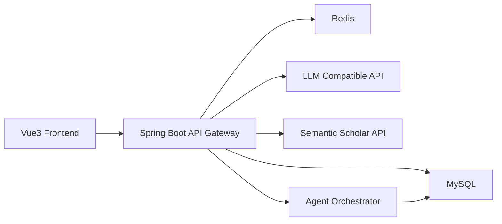

# Smart Code Ark 架构设计

更新时间：2026-03-20

说明：本文档基于当前项目代码、配置和数据库迁移整理。

## 1. 总体架构

## 2. 技术栈

### 2.1 前端

1. Vue 3
2. TypeScript
3. Vite
4. Pinia
5. Vue Router
6. Tailwind CSS
7. Element Plus
8. Axios

### 2.2 后端

1. Java 17
2. Spring Boot 3.4.4
3. Spring Web
4. Spring Data JPA
5. Spring Validation
6. Spring Data Redis
7. Flyway
8. MySQL 8
9. Actuator

## 3. 分层设计

### 3.1 前端分层

1. `src/pages` 页面层
2. `src/components` 组件层
3. `src/stores` 状态管理层
4. `src/api` 接口封装层
5. `src/router` 路由层
6. `src/types` 类型定义层

### 3.2 后端分层

1. `controller` API 层
2. `service` 业务层
3. `agent` 编排层
4. `prompt` Prompt 管理层
5. `db/entity` 实体层
6. `db/repo` 数据访问层
7. `common` 公共能力层

## 4. 核心模块设计

### 4.1 认证模块

1. `AuthController` 暴露注册、登录、短信登录接口
2. `UserAuthService` 处理注册和登录
3. `TokenService` 负责 JWT 签发与解析
4. `AuthInterceptor` 对业务接口鉴权并写入 `RequestContext`
5. `SmsCodeService` 使用 Redis 管理验证码与限流

### 4.2 需求会话模块

1. `ChatController` 提供会话创建、流式会话、历史查询
2. `ChatService` 负责消息持久化与 SSE 推送
3. `ModelService` 调用模型生成回复并抽取结构化需求
4. `prompt_history` 记录模型调用日志

### 4.3 项目确认模块

1. `ProjectService.confirm` 将需求会话转换为正式项目
2. `projects` 保存项目元信息
3. `project_specs` 保存需求快照版本
4. `chat_sessions.project_id` 建立会话与项目关联

### 4.4 任务执行模块

1. `TaskService` 负责任务创建、查询、取消、重试、下载
2. `TaskExecutorService` 通过 `@Async` 异步触发执行
3. `AgentOrchestrator` 负责步骤编排与重试
4. `task_steps` 管理步骤状态
5. `task_logs` 管理执行日志
6. `artifacts` 管理输出产物

### 4.5 Prompt 与模型模块

1. Prompt 模板存放在 `prompt_templates`
2. Prompt 版本存放在 `prompt_versions`
3. `PromptResolver` 解析当前生效模板
4. `PromptRenderer` 渲染模板变量
5. `ModelService` 支持聊天、项目结构生成、文件生成、论文 JSON 输出
6. 模型接口兼容 OpenAI Chat Completions 风格

### 4.6 论文模块

1. `PaperController` 暴露论文提纲生成与查询
2. `SemanticScholarService` 负责外部文献检索
3. `paper_topic_session` 保存论文任务上下文
4. `paper_sources` 保存文献记录
5. `paper_outline_versions` 保存大纲与质量报告

## 5. 任务步骤设计

### 5.1 软件项目生成任务

1. `requirement_analyze`
2. `codegen_backend`
3. `codegen_frontend`
4. `sql_generate`
5. `package`

### 5.2 论文提纲任务

1. `topic_clarify`
2. `academic_retrieve`
3. `outline_generate`
4. `outline_quality_check`

## 6. 存储与运行设计

### 6.1 MySQL

负责保存：

1. 用户
2. 对话会话与消息
3. 项目与项目规格
4. 任务、步骤、日志、产物
5. 计费记录
6. Prompt 模板、版本、历史、缓存
7. 论文主题会话、文献、提纲版本

### 6.2 Redis

当前主要用于短信验证码场景：

1. 验证码缓存
2. 冷却控制
3. 日频控制
4. IP 小时级限流
5. 验证失败计数

### 6.3 开发脚本体系

1. `scripts/dev-up.sh`：启动依赖服务、后端、前端，并写入 `.logs`、`.pids`
2. `scripts/dev-down.sh`：停止前后端进程并停止 MySQL、Redis
3. `scripts/up.sh`：仅启动 Docker Compose 服务
4. `scripts/db-reset.sh`：重建数据库环境
5. `scripts/e2e_smoke.py`：调用接口执行端到端烟测，并校验下载结果

## 7. 外部依赖

1. LLM 兼容接口，默认按 DashScope Compatible Mode 风格接入
2. Semantic Scholar 检索接口

## 8. 配置项

1. `DB_HOST/DB_PORT/DB_NAME/DB_USER/DB_PASSWORD`
2. `REDIS_HOST/REDIS_PORT`
3. `MODEL_BASE_URL`
4. `MODEL_API_KEY`
5. `MODEL_MOCK_ENABLED`
6. `CHAT_MODEL`
7. `CODE_MODEL`
8. `JWT_SECRET`
9. `JWT_TTL_SECONDS`
10. `SEMANTIC_SCHOLAR_BASE_URL`
11. `SEMANTIC_SCHOLAR_API_KEY`
12. `BACKEND_PORT`
13. `FRONTEND_PORT`
