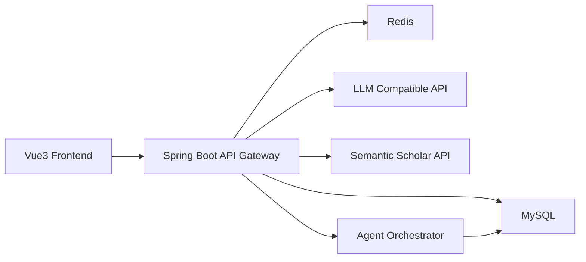

# Smart Code Ark 项目文档总结

更新时间：2026-03-20

说明：本文档基于当前仓库代码整理，优先级高于仓库中已存在但存在编码异常的 README 文本。范围覆盖 `frontend-web` 与 `services/api-gateway-java` 当前实现。

## 文档索引

当前已拆分为以下独立文档：

1. `docs/PRD.md`：面向产品与业务
2. `docs/API规范.md`：面向前后端联调
3. `docs/架构设计.md`：面向研发与运维
4. `docs/数据字典.md`：面向后端、测试、数据治理

## 1. 项目 PRD 文档

### 1.1 项目定位

Smart Code Ark 是一个 AI 驱动的“需求到产物”生成平台，当前已经实现两条核心业务链路：

1. 软件项目生成链路
2. 论文提纲生成链路

### 1.2 当前版本核心能力

1. 用户注册、密码登录、短信登录
2. 需求会话创建与 SSE AI 对话
3. 项目确认与技术栈选择
4. 异步代码生成任务、日志、重试、取消、下载
5. 论文提纲生成与质量检查
6. 额度扣减与计费记录查询
7. 本地一键开发启动与 E2E 冒烟脚本

### 1.3 典型业务流程

#### 软件项目生成

1. 新建项目 -> 创建需求会话
2. 需求对话 -> 形成项目描述
3. 选择技术栈 -> 确认项目
4. 发起生成任务 -> 异步执行 Agent 步骤
5. 查看进度/日志 -> 预览 -> 下载 ZIP

#### 论文提纲生成

1. 提交论文主题信息
2. 生成 `paper_outline` 任务
3. 执行主题澄清、文献检索、提纲生成、质量检查
4. 查询提纲结果

## 2. 最新接口规范

### 2.1 接口分组

1. 认证：`/api/auth`、`/api/v1/auth`
2. 聊天：`/api/chat`、`/api/v1/chat`
3. 项目：`/api/projects`、`/api/v1/projects`
4. 任务：`/api/generate`、`/api/task/...`
5. 论文：`/api/paper/...`
6. 计费：`/api/billing/...`

### 2.2 通用响应

```json
{
  "code": 0,
  "message": "ok",
  "data": {}
}
```

### 2.3 当前接口口径结论

1. 前端任务接口现在已经统一到 `/api/task/...`
2. 聊天接口仍采用 SSE 流式返回 `delta` 和 `result` 事件
3. 前端 `ChatStartResult.stage` 类型仍然宽泛，后端实际返回 `active`
4. 认证/聊天/项目支持 `/api/v1`，任务/论文/计费当前不支持 `/api/v1`

## 3. 项目架构设计

### 3.1 总体架构



### 3.2 技术栈

#### 前端

1. Vue 3
2. TypeScript
3. Vite
4. Pinia
5. Vue Router
6. Tailwind CSS
7. Element Plus
8. Axios

#### 后端

1. Java 17
2. Spring Boot 3.4.4
3. Spring Web
4. Spring Data JPA
5. Spring Data Redis
6. Flyway
7. MySQL 8

### 3.3 运行与联调能力

1. `scripts/dev-up.sh`：一键启动前后端与依赖
2. `scripts/dev-down.sh`：一键停止本地环境
3. `scripts/up.sh`：启动 Docker Compose
4. `scripts/db-reset.sh`：重置数据库
5. `scripts/e2e_smoke.py`：执行注册、登录、项目确认、生成、下载链路烟测

## 4. 数据字典

### 4.1 核心表

1. `users`
2. `chat_sessions`
3. `chat_messages`
4. `projects`
5. `project_specs`
6. `tasks`
7. `task_steps`
8. `task_logs`
9. `artifacts`
10. `billing_records`
11. `prompt_templates`
12. `prompt_versions`
13. `prompt_history`
14. `prompt_cache`
15. `paper_topic_session`
16. `paper_sources`
17. `paper_outline_versions`

### 4.2 关键枚举

1. `project_type`：`web/h5/miniprogram/app`
2. `tasks.task_type`：`generate/modify/paper_outline`
3. `tasks.status`：`queued/running/finished/failed/cancelled/timeout`
4. `task_steps.status`：`pending/running/finished/failed`
5. `task_logs.level`：`info/warn/error`
