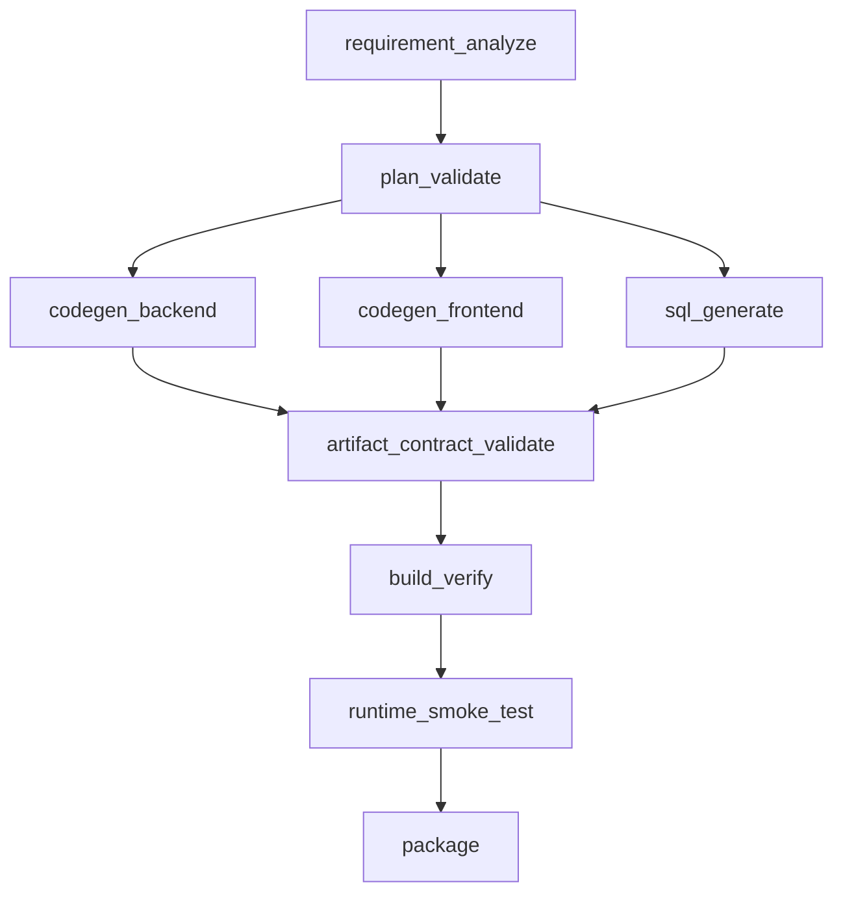

# DeepAgent 链路编排重排设计（代码生成）

## 1. 问题背景

当前代码生成链路节点较多，且部分节点强依赖外部 Java 工具，导致：

- requirement_analyze 易受外部接口时延影响；
- 节点失败时恢复成本高；
- 节点顺序对质量与时延不够友好。

## 2. 重排原则

- 内置优先：先走 DeepAgent 内置能力，外部工具仅做增强。
- 早校验早失败：将低成本硬校验前置。
- 并行化：可独立节点并行执行后汇总。
- 可恢复：每个节点输出可继续下游的最小有效产物。

## 3. 建议目标链路

## 4. 节点说明

### 4.1 requirement_analyze

- 输入：PRD、stack、template hint
- 输出：`file_plan`
- 策略：内置模板+规则先产出，再选择性调用 Java `model/structure` 增强

### 4.2 plan_validate（新增）

- 输入：`file_plan`
- 输出：`validated_plan` + 缺陷清单
- 作用：提前检查路径合法、页面覆盖、模块覆盖

### 4.3 codegen_backend / codegen_frontend / sql_generate

- 输入：`validated_plan`
- 输出：按域拆分的产物集合
- 说明：三者可并行，减少总体时延

### 4.4 artifact_contract_validate

- 输入：三域产物
- 输出：契约一致性报告
- 说明：统一校验 API/DTO/配置/脚本依赖关系

### 4.5 build_verify + runtime_smoke_test

- 输入：合并产物
- 输出：构建与运行验证报告

## 5. 迭代策略

每节点内迭代模板：

1. 生成草稿  
2. 模型自评  
3. 规则校验  
4. 未通过则回到 1（直到 `max_rounds` 或超时）  
5. 超时走降级路径

## 6. 并行策略

- 并行组1：`codegen_backend / codegen_frontend / sql_generate`
- 并行组2（可选）：frontend 可按页面组分批并发生成
- 汇总点：`artifact_contract_validate`

并行时要求：

- 每个子任务带 `subtask_id`；
- 回写日志包含 `subtask_id` 与 `group`；
- 汇总节点只消费“完成态”子任务。

## 7. 降级策略

- Java 增强接口超时：记录 `degrade=true`，继续内置路径。
- 模型输出不稳定：回退到上一轮稳定版本。
- 构建失败：进入 `build_fix_round`，最多 N 轮。

## 8. 性能目标

- requirement_analyze P95 时延下降
- 整体链路成功率提升
- 重试次数与平均重试成本下降

## 9. 风险点

- 节点并行后的依赖冲突
- 多轮迭代引发 token 成本上升
- 降级路径长期占比过高（说明增强接口质量不足）
