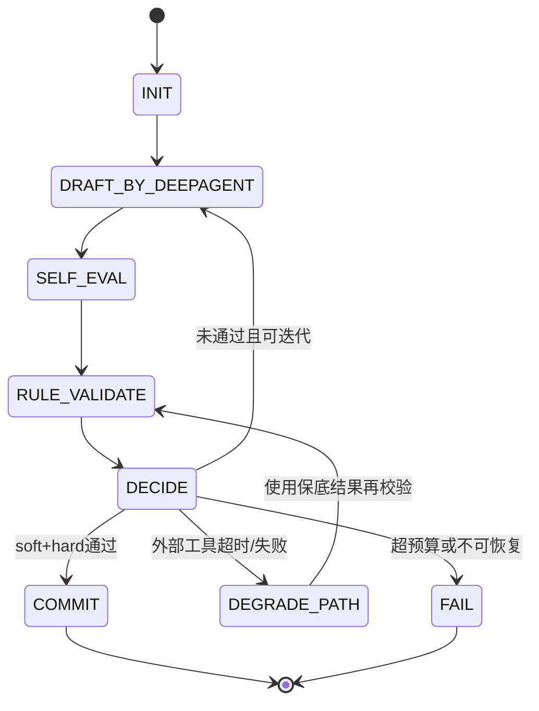

# DeepAgent 节点执行状态机（草案）

本文档定义 DeepAgent 与 Java 工具后端协同的节点级执行模型，目标是提升链路稳定性、可观测性与收敛效率。

## 1. 设计目标

- 支持 DeepAgent 与 Java 能力独立演进，避免单点强依赖。
- 在节点内支持“生成-评估-迭代-提交”的闭环。
- 外部工具超时/失败时可降级，尽量不中断主链路。
- 保留平台侧状态一致性（task/step/log/preview）。

## 2. 双引擎职责边界

### DeepAgent（主执行引擎）

- 负责节点内内容生成、反思迭代、收敛决策。
- 优先调用内置工具与模型能力。
- 在满足准出条件后提交节点结果。

### Java 内部接口（平台治理引擎）

- 负责任务状态回写、日志落库、预览回调、规则/能力增强。
- 可提供可选增强工具（结构规划、模板解析、质量评估等）。
- 非状态类工具调用应支持超时降级，不应阻断主链路。

## 3. 节点状态机

## 4. 统一控制参数

- `max_rounds`: 节点最大迭代轮次（建议 2~4）
- `node_timeout_s`: 节点总预算（建议 60~180）
- `tool_timeout_s`: 外部工具单次预算（建议 10~90）
- `min_quality_score`: 软评估最低阈值
- `hard_checks_required`: 必须通过的硬校验列表

## 5. 准出双门槛

### 软门槛（模型自评）

- PRD 对齐度
- 完整性（关键字段/关键文件）
- 可实现性（技术栈一致、依赖可行）
- 风险评估（列出剩余风险点）

### 硬门槛（规则判定）

- Schema 合法
- 路径合法（禁止绝对路径、`..`）
- 覆盖率达标（业务页面/模块/脚本）
- 构建或静态检查通过（按节点可选）

## 6. 节点模板

### requirement_analyze

- 产物：`file_plan`
- 主路径：内置模板+规则优先
- 外部增强：`/api/internal/model/structure`（可选）
- 硬校验：业务页面路径覆盖、部署关键文件存在

### codegen_backend / codegen_frontend

- 产物：文件内容集合
- 主路径：模型分组生成 + 节点内修复
- 外部增强：`/api/internal/model/generate-file`（可选）
- 硬校验：入口文件存在、语法可解析、关键导入完整

### sql_generate

- 产物：DDL/迁移脚本
- 主路径：内置规则生成
- 外部增强：Java 规则增强（可选）
- 硬校验：主键、索引、外键、命名规范

### build_verify / runtime_smoke_test

- 产物：构建报告与运行结果
- 主路径：sandbox 执行
- 外部增强：状态与预览回写
- 硬校验：退出码、关键错误分类、健康检查

## 7. 降级与失败策略

### 降级触发

- 外部工具超时（ReadTimeout/ConnectTimeout）
- 外部工具 5xx 或非关键 4xx

### 降级动作

- 记录降级事件与原因
- 使用内置保底结果继续
- 回到硬校验判定是否可提交

### 失败条件

- 达到 `max_rounds` 仍不满足硬门槛
- 超过 `node_timeout_s`
- 核心状态回写接口失败（step/log 回写）

## 8. 可观测性规范

每个节点至少记录以下字段：

- `task_id`, `node`, `round`, `mode(normal|degrade)`
- `tool_calls`, `tool_timeout_count`
- `self_score`, `hard_check_pass_count`, `hard_check_fail_reasons`
- `duration_ms`, `final_decision(commit|fail|degrade_commit)`

建议 LangSmith tags：

- `planner_mode=builtin_first`
- `java_enrich=success|timeout|error`
- `fallback_used=true|false`

## 9. 配置开关（建议）

- `DEEPAGENT_REQUIREMENT_BUILTIN_FIRST=true`
- `DEEPAGENT_REQUIREMENT_ENABLE_JAVA_ENRICH=true`
- `DEEPAGENT_REQUIREMENT_JAVA_ENRICH_TIMEOUT=60`
- `DEEPAGENT_NODE_MAX_ROUNDS=3`
- `DEEPAGENT_NODE_TIMEOUT=120`

## 10. 灰度发布计划

1. 仅 `requirement_analyze` 节点开启 builtin-first（10%流量）
2. 指标稳定后扩大到 50%
3. 覆盖到 100% 并扩展到 `codegen_frontend`
4. 再扩展到 `codegen_backend/sql_generate`

关键观测指标：

- requirement_analyze timeout 率
- 节点 P95 耗时
- 任务完成率与失败分布
- 回退触发率与回退后成功率

## 11. 最小验收标准

- Java 外部增强超时时，节点仍可产出并进入后续节点
- `requirement_analyze` 在复杂 PRD 下业务页面覆盖率可达标
- `step-update/log` 全链路可回放
- 不引入无限迭代与重复重试风暴

