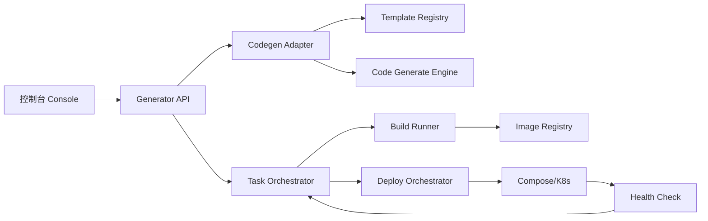

# 基于 JeecgBoot 的项目生成与一键部署技术设计说明书

版本: V1.0  
日期: 2026-04-01  
适用仓库: E:\fuyao\project\smart_code_ark\JeecgBoot

## 1. 目标与范围

### 1.1 目标

建设一个可落地的“项目生成 + 一键部署”能力，满足以下结果:

1. 通过参数化输入生成后端、前端、SQL、部署清单。
2. 自动触发构建、镜像发布、环境部署。
3. 提供任务状态追踪、失败回滚、审计记录。

### 1.2 范围

1. 生成编排层: 新增 `smart-generator-service`。
2. 模板管理层: 管理在线模板版本和扩展参数。
3. 部署编排层: 一键部署到 Docker Compose / Kubernetes。
4. 控制台页面: 创建任务、查看状态、执行回滚。

### 1.3 非目标

1. 不改造 `org.jeecgframework.boot:codegenerate` 内核源码。
2. 不在一期引入多云多集群复杂调度。

## 2. 现状基线

当前 JeecgBoot 的代码生成相关能力如下:

1. 生成核心引擎来自 Maven 依赖 `org.jeecgframework.boot:codegenerate:1.5.5`。
2. 仓库内提供入口包装、模板资源、启动时初始化。
3. 关键路径:
   1. 入口类: `jeecg-system-start` 中 codegenerate 入口。
   2. 模板目录: `jeecg-system-biz/src/main/resources/jeecg/code-template*`。
   3. 启动监听: 模板复制到 `config/jeecg/...`。

## 3. 总体架构



## 4. 组件设计

### 4.1 smart-generator-service

职责:

1. 接收生成请求并校验参数。
2. 调用 codegenerate 入口执行代码生成。
3. 将生成结果封装为构建任务输入。
4. 统一记录任务日志与状态。

建议包结构:

```text
smart-generator-service
  ├─ controller
  ├─ service
  ├─ orchestrator
  ├─ adapter
  ├─ domain
  ├─ infra
  └─ task
```

### 4.2 codegen-adapter

职责:

1. 将业务参数映射到 codegenerate 所需模型。
2. 处理扩展参数 `vueStyle`、包路径、模块路径。
3. 接管模板根目录和输出目录。

输入参数最小集合:

1. `projectCode`
2. `moduleName`
3. `bussiPackage`
4. `tableNames[]`
5. `oneToManyConfig`
6. `templateStyle`
7. `dbSourceKey`
8. `targetBranch`

### 4.3 deploy-orchestrator

职责:

1. 执行构建产物部署。
2. 支持 Compose 与 K8s 两种部署器。
3. 执行部署后健康检查。
4. 失败自动回滚。

## 5. 数据模型设计

建议新增表（MySQL 8）:

```sql
CREATE TABLE gen_project (
  id BIGINT PRIMARY KEY AUTO_INCREMENT,
  project_code VARCHAR(64) NOT NULL UNIQUE,
  project_name VARCHAR(128) NOT NULL,
  owner VARCHAR(64) NOT NULL,
  repo_url VARCHAR(255) NOT NULL,
  template_version VARCHAR(64) NOT NULL,
  created_at DATETIME NOT NULL DEFAULT CURRENT_TIMESTAMP,
  updated_at DATETIME NOT NULL DEFAULT CURRENT_TIMESTAMP ON UPDATE CURRENT_TIMESTAMP
);

CREATE TABLE gen_task (
  id BIGINT PRIMARY KEY AUTO_INCREMENT,
  task_no VARCHAR(64) NOT NULL UNIQUE,
  project_code VARCHAR(64) NOT NULL,
  task_type VARCHAR(32) NOT NULL,
  status VARCHAR(32) NOT NULL,
  trigger_by VARCHAR(64) NOT NULL,
  request_json JSON NOT NULL,
  result_json JSON NULL,
  started_at DATETIME NULL,
  finished_at DATETIME NULL,
  created_at DATETIME NOT NULL DEFAULT CURRENT_TIMESTAMP,
  updated_at DATETIME NOT NULL DEFAULT CURRENT_TIMESTAMP ON UPDATE CURRENT_TIMESTAMP,
  INDEX idx_gen_task_project(project_code),
  INDEX idx_gen_task_status(status)
);

CREATE TABLE gen_release (
  id BIGINT PRIMARY KEY AUTO_INCREMENT,
  project_code VARCHAR(64) NOT NULL,
  release_version VARCHAR(64) NOT NULL,
  git_commit VARCHAR(64) NOT NULL,
  artifact_uri VARCHAR(255) NOT NULL,
  image_uri VARCHAR(255) NOT NULL,
  deploy_env VARCHAR(32) NOT NULL,
  deploy_status VARCHAR(32) NOT NULL,
  health_status VARCHAR(32) NOT NULL,
  created_at DATETIME NOT NULL DEFAULT CURRENT_TIMESTAMP,
  UNIQUE KEY uk_release(project_code, release_version)
);

CREATE TABLE gen_task_log (
  id BIGINT PRIMARY KEY AUTO_INCREMENT,
  task_no VARCHAR(64) NOT NULL,
  stage VARCHAR(32) NOT NULL,
  level VARCHAR(16) NOT NULL,
  message TEXT NOT NULL,
  created_at DATETIME NOT NULL DEFAULT CURRENT_TIMESTAMP,
  INDEX idx_task_log_task(task_no)
);
```

状态机定义:

1. `PENDING`
2. `GENERATING`
3. `BUILDING`
4. `PUSHING_IMAGE`
5. `DEPLOYING`
6. `HEALTH_CHECKING`
7. `SUCCESS`
8. `FAILED`
9. `ROLLED_BACK`

## 6. 接口设计

### 6.1 创建生成任务

`POST /api/gen/projects/{projectCode}/tasks/generate`

请求示例:

```json
{
  "moduleName": "order",
  "bussiPackage": "org.jeecg.modules.demo",
  "tableNames": ["demo_order", "demo_order_item"],
  "templateStyle": "default",
  "oneToMany": {
    "mainTable": "demo_order",
    "subTables": ["demo_order_item"]
  },
  "deploy": {
    "env": "test",
    "mode": "compose",
    "autoDeploy": true
  }
}
```

响应示例:

```json
{
  "taskNo": "GEN202604010001",
  "status": "PENDING"
}
```

### 6.2 查询任务状态

`GET /api/gen/tasks/{taskNo}`

响应示例:

```json
{
  "taskNo": "GEN202604010001",
  "status": "DEPLOYING",
  "stage": "deploy-compose",
  "progress": 82,
  "startedAt": "2026-04-01T10:00:00+08:00"
}
```

### 6.3 回滚发布

`POST /api/gen/projects/{projectCode}/releases/{releaseVersion}/rollback`

响应示例:

```json
{
  "rollbackTaskNo": "ROLLBACK202604010003",
  "status": "PENDING"
}
```

## 7. 与 JeecgBoot 集成策略

### 7.1 模板目录策略

1. 默认模板源: `classpath:jeecg/code-template-online`。
2. 可覆盖目录: `${user.dir}/config/jeecg/code-template-online`。
3. 企业模板建议单独版本化并灰度切换。

### 7.2 输出目录策略

建议统一到:

1. 后端代码: `${GEN_OUTPUT_ROOT}/{projectCode}/backend`
2. 前端代码: `${GEN_OUTPUT_ROOT}/{projectCode}/frontend`
3. SQL 脚本: `${GEN_OUTPUT_ROOT}/{projectCode}/sql`
4. 部署文件: `${GEN_OUTPUT_ROOT}/{projectCode}/deploy`

### 7.3 生成后处理

1. 自动注入统一 `application-*.yml`。
2. 自动生成 Flyway 版本脚本。
3. 自动生成 `Dockerfile`、`docker-compose.yml`、`helm/values.yaml`。

## 8. 一键部署流程

### 8.1 流程

1. 生成代码。
2. 代码质量检查。
3. 构建打包。
4. 构建镜像并推送。
5. 发布到目标环境。
6. 健康检查。
7. 失败回滚。

### 8.2 健康检查规则

1. 后端: `GET /actuator/health` 返回 `UP`。
2. 前端: 首页 `200` 且静态资源加载正常。
3. 数据库: 核心表读写检查。
4. Redis: `PING` 响应正常。

### 8.3 回滚规则

1. 任意阶段失败进入 `FAILED`。
2. 部署阶段失败自动触发回滚任务。
3. 回滚失败进入人工介入。

## 9. 安全与审计

1. 接口权限: `GENERATOR`、`DEPLOYER`、`ADMIN`。
2. 每次发布记录: 操作人、IP、版本、环境、耗时、结果。
3. 密钥管理: 使用环境变量或密钥中心，不写入 Git。
4. 生产发布需要二次确认或审批流。

## 10. 研发任务拆解

### Sprint 1 (1 周)

1. 建立 `smart-generator-service` 基础骨架。
2. 实现任务模型、状态机、日志落库。
3. 打通最小生成链路（不自动部署）。

### Sprint 2 (1 周)

1. 接入构建 runner（Maven + pnpm）。
2. 实现镜像构建与推送。
3. 支持 Compose 部署。

### Sprint 3 (1 周)

1. 实现健康检查与自动回滚。
2. 补全控制台页面。
3. 完成 E2E 联调。

### Sprint 4 (1 周)

1. 支持 K8s 部署模式。
2. 完成告警、审计报表。
3. 验收压测与上线评审。

## 11. 测试与验收

### 11.1 测试清单

1. 单表生成成功。
2. 一对多生成成功。
3. 模板切换生成成功。
4. 构建失败可重试。
5. 部署失败自动回滚。
6. 任务日志完整。

### 11.2 验收指标

1. 全链路成功率 >= 95%。
2. 平均生成+部署耗时 <= 15 分钟。
3. 回滚成功率 >= 99%。

## 12. 风险与缓解

1. 依赖引擎黑盒风险: 通过 adapter 层隔离并固定版本。
2. 模板升级风险: 模板版本化并引入灰度。
3. 环境差异风险: Compose 与 K8s 分开配置。
4. 构建波动风险: 增加缓存与重试策略。

## 13. 交付物清单

1. 设计文档: 本文档。
2. 部署手册: `02-deployment-runbook.md`。
3. 执行检查清单: `03-implementation-checklist.md`。
4. 示例配置: `docs/implementation/examples/`。
