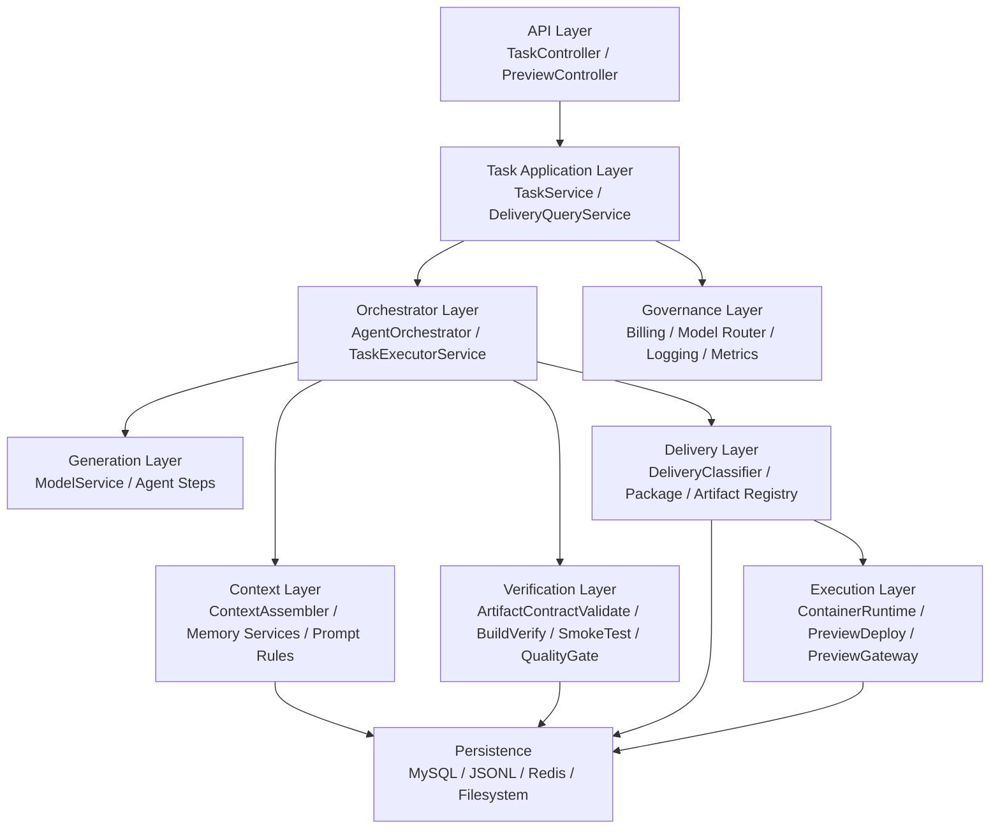

# 代码生成链路可交付治理详细设计与接口规范 v1

## 1. 文档定位

本文档是 [代码生成链路可交付治理技术方案_v1.md](./代码生成链路可交付治理技术方案_v1.md) 的下钻版本，目标是为后续研发提供可直接拆分任务的详细设计输入，覆盖：

1. 详细架构设计
2. 模块与代码功能边界
3. 任务链路状态机
4. 接口清单
5. 接口输入输出规范
6. 错误码与状态约束
7. 兼容与迁移策略

本文档只覆盖“代码生成与交付治理”子系统，不展开认证、聊天、论文、充值等全站业务。

## 2. 设计目标

系统需要同时满足两类目标：

1. **生成效率目标**
   - 继续保留当前“快速草稿生成”能力
   - 允许用户低成本试错

2. **交付质量目标**
   - 明确哪些产物只能算 `draft`
   - 明确哪些产物可算 `validated`
   - 只有满足硬校验的产物才能标记为 `deliverable`

核心原则：

1. 生成和交付是两件事
2. 结构完整不等于可上线
3. 预览可打开不等于可交付
4. 可交付产物必须以真实构建、真实运行、真实冒烟为证据

## 3. 当前实现基线

当前项目中已具备的基础能力：

1. 任务编排：`TaskService` + `TaskExecutorService` + `AgentOrchestrator`
2. 上下文工程化：`ContextAssembler` + `TaskMemoryService` + `LongTermMemoryService` + `StepMemoryService`
3. 模型治理：`ModelService` + `ModelRouterService`
4. 交付物处理：`ArtifactContractValidateStep` + `PackageStep`
5. 预览运行时：`PreviewDeployService` + `ContainerRuntimeService` + `PreviewGatewayService`
6. 观测与记账：`TraceIdFilter` + `LoggingFilter` + `BillingService` + `TaskLog`

当前主要缺口：

1. 缺少模板脚手架层
2. 缺少真实构建校验层
3. 缺少真实运行冒烟测试层
4. 缺少交付等级分类层
5. 缺少标准化交付报告接口

## 4. 目标架构

## 4.1 分层架构



## 4.2 逻辑职责

### API Layer

职责：

1. 暴露任务创建、查询、验证、下载、预览接口
2. 统一响应结构
3. 入参校验、鉴权、错误码映射

不负责：

1. 任务编排
2. 构建命令执行
3. 交付等级判定

### Task Application Layer

职责：

1. 创建任务和步骤
2. 汇总任务结果
3. 读取交付报告
4. 管理重试、取消、重建预览

不负责：

1. 直接调用模型生成
2. 直接执行 Docker 命令

### Orchestrator Layer

职责：

1. 驱动 step 依次执行
2. 加载上下文和记忆
3. 记录步骤日志与状态
4. 调用质量门禁、验证层和自动修复

不负责：

1. 对外 HTTP 返回
2. 构建脚手架内容定义

### Context Layer

职责：

1. 装配 prompt context
2. 管理短期和长期记忆
3. 注入模板约束、交付目标、失败回执

不负责：

1. 执行构建命令
2. 输出最终交付物

### Generation Layer

职责：

1. 生成业务代码
2. 生成 SQL、配置、页面
3. 按模板允许范围修改文件

不负责：

1. 判定产物是否可交付

### Verification Layer

职责：

1. 结构校验
2. 真实 build 校验
3. 真实 runtime smoke test
4. 输出报告与阻塞项

不负责：

1. 最终打包下载

### Delivery Layer

职责：

1. 综合所有报告
2. 给出 `draft / validated / deliverable`
3. 生成交付报告
4. 产出 ZIP 和报告类 artifact

不负责：

1. 运行预览容器

### Governance Layer

职责：

1. quota 扣费
2. 模型路由和用量记录
3. trace / logging / metrics
4. 交付事件审计

不负责：

1. 文件生成
2. 前端页面渲染

## 5. 模块与代码边界

## 5.1 现有模块保留

以下模块建议保留并增强：

1. `TaskService`
2. `AgentOrchestrator`
3. `ContextAssembler`
4. `TaskMemoryService`
5. `LongTermMemoryService`
6. `StepMemoryService`
7. `ModelService`
8. `ModelRouterService`
9. `PreviewDeployService`
10. `ContainerRuntimeService`
11. `PackageStep`
12. `ArtifactContractValidateStep`
13. `QualityGateService`

## 5.2 建议新增模块

### 应用服务

1. `DeliveryQueryService`
2. `TemplateRegistryService`
3. `WorkspaceScaffoldService`

### 编排 step

1. `ScaffoldPrepareStep`
2. `BuildVerifyStep`
3. `RuntimeSmokeTestStep`
4. `DeliveryClassifyStep`

### 核心服务

1. `BuildVerifyService`
2. `SmokeTestService`
3. `DeliveryClassifierService`
4. `DeliveryReportService`
5. `RepairLoopService`
6. `RuntimeExecutionService`
7. `TemplateGuardService`

### DTO

1. `GenerateOptions`
2. `DeliveryReportResult`
3. `BuildVerifyReportResult`
4. `SmokeTestReportResult`
5. `TaskArtifactsResult`
6. `TemplateSummaryResult`
7. `TemplateDetailResult`

## 5.3 包结构建议

建议新增以下包：

```text
services/api-gateway-java/src/main/java/com/smartark/gateway/
  delivery/
    DeliveryClassifierService.java
    DeliveryReportService.java
    BuildVerifyService.java
    SmokeTestService.java
    RepairLoopService.java
    RuntimeExecutionService.java
    TemplateRegistryService.java
    WorkspaceScaffoldService.java
    TemplateGuardService.java
  agent/step/
    ScaffoldPrepareStep.java
    BuildVerifyStep.java
    RuntimeSmokeTestStep.java
    DeliveryClassifyStep.java
  dto/
    GenerateOptions.java
    DeliveryReportResult.java
    BuildVerifyReportResult.java
    SmokeTestReportResult.java
    TaskArtifactsResult.java
    TemplateSummaryResult.java
    TemplateDetailResult.java
```

## 6. 任务链路与状态机

## 6.1 任务等级

### draft

适用场景：

1. 用户先看思路
2. 快速生成样例
3. 不要求可直接部署

规则：

1. 允许无模板
2. 允许结构 autofix
3. 允许 preview fallback
4. 不承诺 build 通过

### validated

适用场景：

1. 希望拿到结构完整、基础可构建的工程

规则：

1. 建议模板化
2. 必须通过 `artifact_contract_validate`
3. 必须通过 `build_verify`
4. runtime smoke 可选

### deliverable

适用场景：

1. 目标是直接交付验收

规则：

1. 必须模板化
2. 必须通过 `artifact_contract_validate`
3. 必须通过 `build_verify`
4. 必须通过 `runtime_smoke_test`
5. 禁止 preview fallback 充当成功证据

## 6.2 任务步骤定义

### 目标步骤清单

1. `scaffold_prepare`
2. `requirement_analyze`
3. `codegen_backend`
4. `codegen_frontend`
5. `sql_generate`
6. `artifact_contract_validate`
7. `build_verify`
8. `runtime_smoke_test`
9. `delivery_classify`
10. `package`

### 各步骤责任

#### `scaffold_prepare`

输入：

1. `templateId`
2. `deliveryLevel`
3. `project stack`

输出：

1. 初始 workspace
2. `template_meta.json`

#### `requirement_analyze`

输入：

1. 用户需求
2. 模板契约

输出：

1. 文件计划
2. 模块清单
3. 页面清单

#### `codegen_backend`

输入：

1. 需求结构
2. 模板骨架
3. 上下文记忆

输出：

1. 后端源码
2. 配置文件

#### `codegen_frontend`

输入：

1. 页面/模块计划
2. 模板骨架

输出：

1. 前端源码
2. 路由与页面

#### `sql_generate`

输入：

1. 数据模型
2. 模板约束

输出：

1. SQL 文件
2. schema 更新

#### `artifact_contract_validate`

输入：

1. workspace

输出：

1. `contract_report.json`
2. 结构型阻塞项/警告项

#### `build_verify`

输入：

1. workspace
2. template command spec

输出：

1. `build_verify_report.json`
2. build logs
3. failure summary

#### `runtime_smoke_test`

输入：

1. 已通过 build 的 workspace

输出：

1. `smoke_test_report.json`
2. runtime logs
3. health / api 检查结果

#### `delivery_classify`

输入：

1. contract report
2. build report
3. smoke report
4. requested delivery level

输出：

1. `delivery_report.json`
2. actual delivery level

#### `package`

输入：

1. delivery report
2. workspace

输出：

1. zip artifact
2. manifest artifact
3. report artifacts

## 6.3 状态机

### Task status

```text
queued -> running -> finished
queued -> running -> failed
queued -> running -> cancelled
queued -> running -> timeout
failed -> running  (retry from step)
cancelled -> running (manual retry)
```

### Preview status

```text
provisioning -> ready
provisioning -> failed
ready -> expired
failed -> provisioning (rebuild)
expired -> provisioning (rebuild)
```

### Delivery status

建议新增：

```text
pending -> draft
pending -> validated
pending -> deliverable
pending -> failed
```

## 7. 关键对象设计

## 7.1 GenerateOptions

```json
{
  "deliveryLevel": "draft",
  "templateId": "springboot-vue3-mysql",
  "strictDelivery": false,
  "enablePreview": true,
  "enableAutoRepair": true
}
```

字段规范：

1. `deliveryLevel`
   - 必填
   - 枚举：`draft | validated | deliverable`
2. `templateId`
   - `validated/deliverable` 模式必填
3. `strictDelivery`
   - `true` 时，任何 blocker 直接失败
4. `enablePreview`
   - 是否在任务完成后自动发布预览
5. `enableAutoRepair`
   - 是否允许执行自动修复回路

## 7.2 DeliveryReportResult

```json
{
  "taskId": "string",
  "deliveryLevelRequested": "deliverable",
  "deliveryLevelActual": "validated",
  "status": "failed",
  "passed": false,
  "blockingIssues": [
    {
      "stage": "build_verify",
      "code": "frontend_build_failed",
      "message": "vite build failed",
      "logRef": "file:///.../task-build.log"
    }
  ],
  "warnings": [
    "preview gateway disabled"
  ],
  "reports": {
    "contractReportUrl": "file:///.../contract_report.json",
    "buildReportUrl": "file:///.../build_verify_report.json",
    "smokeReportUrl": "file:///.../smoke_test_report.json"
  },
  "generatedAt": "2026-03-24T20:00:00"
}
```

## 7.3 BuildVerifyReportResult

```json
{
  "taskId": "string",
  "passed": false,
  "commands": [
    {
      "name": "frontend_build",
      "command": "npm run build",
      "exitCode": 1,
      "durationMs": 4821,
      "status": "failed",
      "logRef": "file:///.../frontend-build.log"
    }
  ],
  "blockingIssues": [
    {
      "code": "frontend_build_failed",
      "message": "cannot resolve import '@/api/http'"
    }
  ],
  "generatedAt": "2026-03-24T20:00:00"
}
```

## 7.4 SmokeTestReportResult

```json
{
  "taskId": "string",
  "passed": true,
  "checks": [
    {
      "name": "frontend_home",
      "method": "GET",
      "url": "http://localhost:30001/",
      "expectedStatus": 200,
      "actualStatus": 200,
      "durationMs": 80,
      "status": "passed"
    },
    {
      "name": "backend_health",
      "method": "GET",
      "url": "http://localhost:30002/actuator/health",
      "expectedStatus": 200,
      "actualStatus": 200,
      "durationMs": 45,
      "status": "passed"
    }
  ],
  "generatedAt": "2026-03-24T20:00:00"
}
```

## 7.5 TaskArtifactsResult

```json
{
  "taskId": "string",
  "artifacts": [
    {
      "type": "zip",
      "subtype": "delivery_bundle",
      "verified": true,
      "url": "file:///.../task.zip"
    },
    {
      "type": "report",
      "subtype": "delivery_report",
      "verified": true,
      "url": "file:///.../delivery_report.json"
    }
  ]
}
```

## 8. API 设计

## 8.1 设计原则

1. 保持现有 `/api/generate`、`/api/task/{taskId}/status` 等主路径不变
2. 增量扩展，不大改前端已有接口
3. 所有新增接口统一走 `ApiResponse<T>`
4. 文件下载类接口继续保留原始二进制输出

## 8.2 统一响应

```json
{
  "code": 0,
  "message": "ok",
  "data": {}
}
```

## 8.3 接口清单

### A. 任务创建与状态

1. `POST /api/generate`
2. `GET /api/task/{taskId}/status`
3. `POST /api/task/{taskId}/modify`
4. `POST /api/task/{taskId}/cancel`
5. `POST /api/task/{taskId}/retry/{stepCode}`

### B. 交付与验证

1. `GET /api/task/{taskId}/contract-report`
2. `POST /api/task/{taskId}/delivery/validate`
3. `GET /api/task/{taskId}/delivery-report`
4. `GET /api/task/{taskId}/build-report`
5. `GET /api/task/{taskId}/smoke-report`
6. `GET /api/task/{taskId}/artifacts`

### C. 预览

1. `GET /api/task/{taskId}/preview`
2. `POST /api/task/{taskId}/preview/rebuild`
3. `GET /api/task/{taskId}/preview/logs`
4. `GET /api/preview/{taskId}/**`
5. `GET /p/{taskId}/**`

### D. 模板

1. `GET /api/templates`
2. `GET /api/templates/{templateId}`

### E. 日志与下载

1. `GET /api/task/{taskId}/logs`
2. `GET /api/task/{taskId}/download`

## 9. 接口输入输出规范

## 9.1 `POST /api/generate`

### 用途

创建代码生成任务。

### 请求体

```json
{
  "projectId": "string",
  "instructions": "string",
  "options": {
    "deliveryLevel": "draft",
    "templateId": "springboot-vue3-mysql",
    "strictDelivery": false,
    "enablePreview": true,
    "enableAutoRepair": true
  }
}
```

### 字段约束

1. `projectId`
   - 必填
   - 对应已确认项目
2. `instructions`
   - 可选
   - 最大建议 8000 字符
3. `options`
   - 可选
   - 缺省时后端补默认值
4. `options.deliveryLevel`
   - 缺省：`draft`
5. `options.templateId`
   - 当 `deliveryLevel in [validated, deliverable]` 时必填

### 响应体

```json
{
  "code": 0,
  "message": "ok",
  "data": {
    "taskId": "string",
    "status": "queued"
  }
}
```

### 错误码

1. `1001` 参数不合法
2. `1003` 项目无权限
3. `2001` quota 不足
4. `3203` 模板缺失
5. `3204` 交付等级与模板要求不匹配

## 9.2 `GET /api/task/{taskId}/status`

### 用途

查询任务运行状态。

### 响应体

```json
{
  "code": 0,
  "message": "ok",
  "data": {
    "status": "running",
    "progress": 70,
    "step": "build_verify",
    "current_step": "build_verify",
    "projectId": "string",
    "errorCode": null,
    "errorMessage": null,
    "startedAt": "2026-03-24T20:00:00",
    "finishedAt": null,
    "deliveryLevelRequested": "deliverable",
    "deliveryLevelActual": null,
    "deliveryStatus": "pending"
  }
}
```

### 兼容策略

1. 保留现有字段
2. 新字段只追加，不删除原字段

## 9.3 `POST /api/task/{taskId}/modify`

### 请求体

```json
{
  "changeInstructions": "请将首页改为卡片风格，并补充用户中心"
}
```

### 响应体

```json
{
  "code": 0,
  "message": "ok",
  "data": {
    "taskId": "string",
    "status": "queued"
  }
}
```

## 9.4 `GET /api/task/{taskId}/contract-report`

### 响应体

```json
{
  "code": 0,
  "message": "ok",
  "data": {
    "passed": false,
    "failedRules": [
      "missing_required_file",
      "invalid_compose_context"
    ],
    "fixedActions": [
      "generated_docker_compose_yml"
    ],
    "generatedAt": "2026-03-24T20:00:00"
  }
}
```

## 9.5 `POST /api/task/{taskId}/delivery/validate`

### 用途

手动触发交付校验。

### 请求体

```json
{
  "autoFix": true
}
```

### 响应体

保持兼容，第一阶段仍返回 `ContractReportResult`，第二阶段建议升级为统一 `DeliveryReportResult`。

## 9.6 `GET /api/task/{taskId}/delivery-report`

### 用途

查询交付分级与阻塞项。

### 响应体

```json
{
  "code": 0,
  "message": "ok",
  "data": {
    "taskId": "string",
    "deliveryLevelRequested": "deliverable",
    "deliveryLevelActual": "validated",
    "status": "failed",
    "passed": false,
    "blockingIssues": [
      {
        "stage": "runtime_smoke_test",
        "code": "backend_health_failed",
        "message": "GET /actuator/health returned 500",
        "logRef": "file:///.../smoke.log"
      }
    ],
    "warnings": [],
    "reports": {
      "contractReportUrl": "file:///.../contract_report.json",
      "buildReportUrl": "file:///.../build_verify_report.json",
      "smokeReportUrl": "file:///.../smoke_test_report.json"
    },
    "generatedAt": "2026-03-24T20:00:00"
  }
}
```

## 9.7 `GET /api/task/{taskId}/build-report`

### 响应体

返回 `BuildVerifyReportResult`

## 9.8 `GET /api/task/{taskId}/smoke-report`

### 响应体

返回 `SmokeTestReportResult`

## 9.9 `GET /api/task/{taskId}/artifacts`

### 响应体

```json
{
  "code": 0,
  "message": "ok",
  "data": {
    "taskId": "string",
    "artifacts": [
      {
        "type": "zip",
        "subtype": "delivery_bundle",
        "verified": false,
        "url": "file:///.../task.zip"
      },
      {
        "type": "report",
        "subtype": "delivery_report",
        "verified": true,
        "url": "file:///.../delivery_report.json"
      }
    ]
  }
}
```

## 9.10 `GET /api/task/{taskId}/preview`

### 响应体

兼容现有结构，并追加校验字段：

```json
{
  "code": 0,
  "message": "ok",
  "data": {
    "taskId": "string",
    "status": "ready",
    "phase": null,
    "previewUrl": "/p/abc123/",
    "expireAt": "2026-03-25T20:00:00",
    "lastError": null,
    "lastErrorCode": null,
    "buildLogUrl": "file:///.../preview-build.log",
    "verificationSource": "runtime",
    "isFallback": false
  }
}
```

### 字段说明

1. `verificationSource`
   - 枚举：`runtime | gateway | fallback`
2. `isFallback`
   - `true` 时不允许算作 `deliverable` 证据

## 9.11 `POST /api/task/{taskId}/preview/rebuild`

### 响应体

继续返回 `TaskPreviewResult`

### 状态约束

仅允许：

1. `failed`
2. `expired`

否则返回：

1. `1005 PREVIEW_REBUILD_STATE_INVALID`

## 9.12 `GET /api/task/{taskId}/preview/logs?tail=200`

### 响应体

```json
{
  "code": 0,
  "message": "ok",
  "data": {
    "taskId": "string",
    "logs": [
      {
        "ts": 1742817600000,
        "level": "info",
        "message": "npm install completed"
      }
    ]
  }
}
```

## 9.13 `GET /api/task/{taskId}/logs`

### 响应体

```json
{
  "code": 0,
  "message": "ok",
  "data": [
    {
      "id": 1,
      "level": "info",
      "content": "Task started",
      "ts": 1742817600000
    }
  ]
}
```

## 9.14 `GET /api/task/{taskId}/download`

### 用途

下载 ZIP 交付物。

### 响应

`application/zip`

### Header

```http
Content-Disposition: attachment; filename="smartark_<taskId>.zip"
```

## 9.15 `GET /api/templates`

### 响应体

```json
{
  "code": 0,
  "message": "ok",
  "data": [
    {
      "templateId": "springboot-vue3-mysql",
      "name": "Spring Boot + Vue3 + MySQL",
      "deliveryLevels": [
        "validated",
        "deliverable"
      ],
      "enabled": true
    }
  ]
}
```

## 9.16 `GET /api/templates/{templateId}`

### 响应体

```json
{
  "code": 0,
  "message": "ok",
  "data": {
    "templateId": "springboot-vue3-mysql",
    "name": "Spring Boot + Vue3 + MySQL",
    "stack": {
      "backend": "springboot",
      "frontend": "vue3",
      "db": "mysql"
    },
    "requiredFiles": [
      "docker-compose.yml",
      "scripts/start.sh",
      "frontend/package.json",
      "backend/pom.xml"
    ],
    "buildCommands": [
      "./backend/mvnw -q -DskipTests package",
      "cd frontend && npm install && npm run build"
    ],
    "smokeChecks": [
      {
        "name": "backend_health",
        "url": "/actuator/health",
        "expectedStatus": 200
      }
    ]
  }
}
```

## 10. 错误码设计

## 10.1 复用现有错误码

1. `1001` 参数错误
2. `1002` 未登录
3. `1003` 无权限
4. `1004` 资源不存在
5. `1005` 状态冲突
6. `1006` 限流
7. `2001` quota 不足
8. `3001` 模型错误
9. `3002` 任务失败
10. `3006` 任务校验失败
11. `3101-3106` 预览错误
12. `3201-3202` 交付报告错误

## 10.2 建议新增错误码

1. `3203 TEMPLATE_NOT_FOUND`
2. `3204 TEMPLATE_REQUIRED_FOR_DELIVERABLE`
3. `3205 BUILD_VERIFY_FAILED`
4. `3206 SMOKE_TEST_FAILED`
5. `3207 DELIVERY_LEVEL_DOWNGRADED`
6. `3208 DELIVERY_REPORT_NOT_READY`
7. `3209 ARTIFACTS_NOT_READY`

## 11. 兼容策略

## 11.1 保持兼容的接口

保持原路径不变：

1. `/api/generate`
2. `/api/task/{taskId}/status`
3. `/api/task/{taskId}/preview`
4. `/api/task/{taskId}/modify`
5. `/api/task/{taskId}/download`

## 11.2 追加字段，不删字段

以下 DTO 采用追加字段策略：

1. `GenerateRequest`
   - 新增 `options`
2. `TaskStatusResult`
   - 新增交付等级与交付状态字段
3. `TaskPreviewResult`
   - 新增 `verificationSource`、`isFallback`

## 11.3 平滑迁移

### 第一阶段

1. 保持 `delivery/validate` 仍返回 `ContractReportResult`
2. 新增 `delivery-report` 作为完整报告读取接口

### 第二阶段

1. 前端统一切到 `delivery-report`
2. `delivery/validate` 返回值可升级为完整 `DeliveryReportResult`

## 12. 实施建议

## 12.1 开发顺序

第一批：

1. 新增 DTO 和接口规范
2. 为 `GenerateRequest` 增加 `options`
3. 为 `TaskStatusResult` 增加 delivery 字段
4. 新增 `DeliveryReportResult`

第二批：

1. 新增 `BuildVerifyService`
2. 新增 `BuildVerifyStep`
3. 打通 `delivery_report.json`

第三批：

1. 新增模板服务
2. 新增 `ScaffoldPrepareStep`
3. 接入模板强约束

第四批：

1. 新增 `SmokeTestService`
2. 新增 `RuntimeSmokeTestStep`
3. deliverable 模式禁用 preview fallback

## 12.2 MVP 判定

满足以下条件即可视为本轮详细设计落地完成：

1. 已支持 `deliveryLevel/templateId`
2. 已支持 `delivery-report`
3. 已支持 `build-report`
4. 已能对 `deliverable` 任务给出明确 blocking issues
5. 已能在前端区分 `draft / validated / deliverable`

