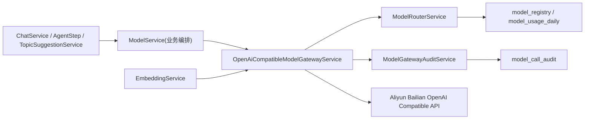

# 模型调用网关设计方案 v1

## 1. 目标

基于阿里云百炼 OpenAI 兼容模式官方文档，构建统一的模型调用网关，收敛以下职责：

- 统一模型调用协议，业务侧不再重复处理 `baseUrl/apiKey/model/provider`
- 统一模型配置管理，模型注册、路由、连通性测试、密钥管理统一归口
- 统一错误码、调用日志、审计字段，便于接 Prometheus / Loki / 告警平台
- 统一后续扩展入口，为 `tools / structured output / responses / batch` 预留演进空间

## 2. 现状问题

当前代码的主要问题集中在四点：

- `ModelService` 既负责 prompt 业务，又负责 HTTP 协议细节，职责过重
- 模型调用仍以 `RestClient + 手写 JSON` 为主，和官方 SDK 脱节
- 错误码过粗，绝大多数异常都压缩成 `MODEL_SERVICE_ERROR`
- 缺少独立的模型调用审计表，出入参、traceId、requestId、token 用量难以沉淀

## 3. 官方文档约束

本方案严格按以下官方资料约束兼容层：

- 百炼 SDK 安装文档：推荐 Java 使用 `com.openai:openai-java`
- 百炼 OpenAI Chat API 文档：对齐 `chat.completions`
- 百炼 OpenAI Embedding 文档：对齐 `embeddings`
- 百炼 OpenAI 兼容模式文档：统一使用 `https://dashscope.aliyuncs.com/compatible-mode/v1`

设计原则：

- 网关只向上暴露内部统一命令对象，不向业务透传 SDK 细节
- 对上游保持“官方字段优先”，不自造兼容层私有字段污染请求体
- 本地超时、路由、审计是网关责任，不下沉到业务代码

## 4. 目标架构

职责边界：

- `ModelService`
  - 保留 prompt 组织、结构化纠偏、业务编排
  - 不再负责底层协议和异常映射
- `OpenAiCompatibleModelGatewayService`
  - 负责 SDK 调用、超时、重试、错误归类、返回标准化
- `ModelRouterService`
  - 负责模型选择、优先级、日额度切换、密钥解密
- `ModelGatewayAuditService`
  - 负责请求审计、trace 关联、token 用量、上游 requestId 落库

## 5. 本次已落地内容

### 5.1 统一网关层

新增：

- `OpenAiCompatibleModelGatewayService`
- `ModelGatewayInvocation`
- `ModelGatewayResult`
- `ModelGatewayEndpoint`

特点：

- 使用 OpenAI Java SDK 调用百炼 OpenAI 兼容接口
- 支持 `chat.completions` 与 `embeddings`
- 基于 `RequestOptions.timeout` 控制单次请求超时
- 基于 SDK 原生异常映射业务错误码

### 5.2 审计与可观测性

新增表：

- `model_call_audit`

关键字段：

- `trace_id`
- `biz_scene`
- `provider`
- `endpoint`
- `model_name`
- `upstream_request_id`
- `token_input / token_output / token_total`
- `request_body / response_body`
- `error_code / error_message`

### 5.3 错误码细化

新增模型网关错误码：

- `3008 MODEL_CONFIG_MISSING`
- `3009 MODEL_BAD_REQUEST`
- `3010 MODEL_AUTH_FAILED`
- `3011 MODEL_RATE_LIMITED`
- `3012 MODEL_UPSTREAM_UNAVAILABLE`
- `3013 MODEL_UPSTREAM_TIMEOUT`
- `3014 MODEL_OUTPUT_EMPTY`
- `3015 MODEL_UNSUPPORTED_OPERATION`

### 5.4 存量链路兼容

已完成兼容接入：

- `ModelService` 的同步 `callModelApi(...)` 已改走新网关
- `EmbeddingService` 已改走新网关
- `streamChatReply(...)` 暂保留原实现，避免一次性改动流式 SSE 链路

## 6. 推荐统一内部 API

建议后续业务仅依赖以下两类能力：

### 6.1 文本生成

- 输入
  - `endpoint=chat.completions`
  - `model`
  - `messages`
  - `temperature / top_p / max_tokens / response_format / tools / tool_choice`
  - `bizScene`
  - `timeoutMs`

- 输出
  - `body`
  - `upstreamRequestId`
  - `httpStatus`
  - `tokenInput / tokenOutput / tokenTotal`

### 6.2 向量化

- 输入
  - `endpoint=embeddings`
  - `model`
  - `input`
  - `dimensions`
  - `encoding_format`
  - `bizScene`

- 输出
  - `body`
  - `upstreamRequestId`
  - `httpStatus`
  - `tokenInput / tokenTotal`

## 7. 后续必须补齐的二期项

为了真正达到“生产级完整态”，建议继续补以下内容：

### 7.1 流式能力统一

- 将 `streamChatReply(...)` 迁移到 SDK Streaming
- 审计流式首包时延、总时长、chunk 数、finish_reason

### 7.2 结构化输出与工具调用

- 为 `response_format.json_schema` 提供显式封装
- 将 `tools/tool_choice/parallel_tool_calls` 提升为内部强类型对象
- 将论文、代码生成链路的结构化输出全部切到统一网关入口

### 7.3 监控告警

- 暴露按模型、endpoint、错误码、业务场景维度的 Micrometer 指标
- 为 `401/429/5xx/timeout` 建告警阈值
- 增加慢调用阈值告警

### 7.4 配置治理

- 在 `model_registry` 补充能力标签，例如 `supports_stream / supports_tools / supports_json_schema`
- 增加 `request_timeout_ms`、`max_context_tokens`、`remarks` 等配置字段
- 后台只允许配置兼容模式根地址，不允许填完整接口地址

## 8. 迁移策略

建议按三步走：

1. 先让所有同步调用统一经过网关
2. 再迁移流式链路和结构化输出链路
3. 最后收口旧的 `RestClient` 直连实现

这样可以避免一次性重构造成论文链路、代码生成链路和聊天链路同时抖动。

## 9. 验收标准

至少满足以下条件后，再认为模型网关达到可上线标准：

- 同步聊天与向量化全部经过统一网关
- 审计表能查到 request/response、traceId、requestId、token
- 上游 400/401/429/5xx/timeout 能映射为稳定业务错误码
- 模型配置和路由切换不需要业务改代码
- 至少覆盖单测、连通性测试、灰度压测三类验证
