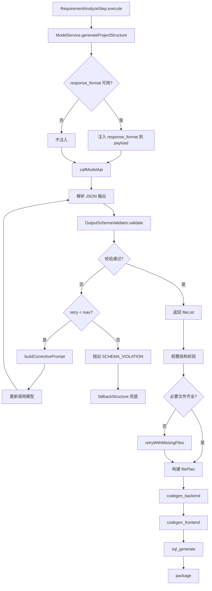
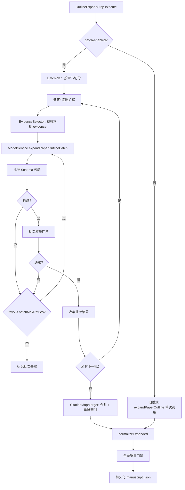

# 链路健壮性治理方案 v2.0

> 版本：v2.0
> 日期：2026-03-23
> 范围：项目代码生成链路 + 论文正文扩写链路
> 前置文档：[项目生成与论文生成链路详解](./项目生成与论文生成链路详解.md)、[PRD v3.6 分批扩写方案设计](./PRD_v3.6_outline_expand_分批扩写方案设计.md)

---

## 1. 问题总述

### 1.1 项目代码生成链路

| 现象 | 根因 | 影响 |
|------|------|------|
| 任务脚本（`start.sh`/`deploy.sh`）无法执行 | 模型输出的文件结构缺少关键文件（`pom.xml`、`package.json`、`docker-compose.yml` 等） | 预览构建失败，用户体验断裂 |
| `PackageStep` 补齐的文件是空壳 | 后置修补只能生成最小骨架，无法补全业务逻辑 | 部署产物无法运行 |
| 同一 PRD 多次生成结构不一致 | 模型输出无 Schema 约束，格式自由度过高 | 质量不可预期 |
| 重试是盲重试 | `AgentOrchestrator` 重试时使用相同 prompt，不携带失败原因 | 重试成功率低 |

**关键代码路径**：
- `RequirementAnalyzeStep.execute` → `ModelService.generateProjectStructure`
- `AbstractCodegenStep.generateFilesByGroup` → `ModelService.generateFileContent`
- `ArtifactContractValidateStep.execute`（第 5 步才校验，为时已晚）
- `PackageStep.execute`（兜底补文件，治标不治本）

### 1.2 论文正文扩写链路

| 现象 | 根因 | 影响 |
|------|------|------|
| `outline_expand` 步骤长时间无响应（60s~120s） | 全量 outline + sources + ragEvidence 一次性发送，token 输入过大 | 任务卡死，用户等待超时 |
| 正文出现占位文本（placeholder/待补充） | 长上下文下模型稳定性下降，结构漂移 | 质量门禁拦截后重试依然失败 |
| 模型超时后 fallback 返回空壳文稿 | `expandPaperOutline` 异常后直接走 `fallbackExpandedManuscript` | 产出无价值 |

**关键代码路径**：
- `OutlineExpandStep.execute`（当前已有 3 次重试 + 质量门禁）
- `ModelService.expandPaperOutline` → `runPromptForJson`
- V26 migration 已升级 prompt（version_no=4），但未解决输入规模问题

---

## 2. 治理目标

| 指标 | 当前 | 目标 |
|------|------|------|
| 项目生成-文件结构完整率 | ~60%（依赖 fallback 补齐） | >95%（Schema 约束 + 前置校验） |
| 项目生成-首次生成可运行率 | ~40% | >80% |
| 论文扩写-步骤平均耗时 | 60~120s | <40s（分批后单批 15~25s） |
| 论文扩写-占位文本失败率 | ~30% | <5% |
| 重试成功率 | ~20%（盲重试） | >60%（corrective retry） |

---

## 3. 方案一：项目代码生成链路 — Schema 校验 + Corrective Retry

### 3.1 总体架构变更

```
┌─────────────────────────────────────────────────────────────────┐
│                       ModelService                              │
│                                                                 │
│  callModelApi(payload)                                          │
│       │                                                         │
│       ▼                                                         │
│  [response_format 注入] ← OutputSchemaValidator.buildResponseFormat │
│       │                                                         │
│       ▼                                                         │
│  解析 LLM 输出                                                   │
│       │                                                         │
│       ▼                                                         │
│  [Schema 校验] ← OutputSchemaValidator.validate                  │
│       │                                                         │
│    pass? ──yes──▶ 返回结果                                       │
│       │                                                         │
│      no                                                         │
│       │                                                         │
│       ▼                                                         │
│  [构造修正 prompt] ← OutputSchemaValidator.buildCorrectivePrompt │
│       │                                                         │
│       ▼                                                         │
│  重试（最多 N 次）                                                │
└─────────────────────────────────────────────────────────────────┘
```

### 3.2 新增组件：OutputSchemaValidator

**文件**：`com.smartark.gateway.service.OutputSchemaValidator`

**职责**：
1. 从 `prompt_versions.output_schema_json` 读取 JSON Schema 并缓存
2. 校验 LLM 输出是否符合 Schema
3. 生成 `response_format` payload（用于支持该特性的模型 API）
4. 生成修正 prompt（用于 corrective retry）

**核心方法**：

```java
// 校验输出
ValidationResult validate(String templateKey, JsonNode output);

// 构建 response_format（OpenAI 兼容 API）
Map<String, Object> buildResponseFormat(String templateKey);

// 构建修正 prompt
String buildCorrectivePrompt(String previousOutput, List<String> errors);
```

**Schema 缓存策略**：
- 使用 `ConcurrentHashMap<templateKey, JsonSchema>` 缓存编译后的 Schema
- 提供 `invalidateCache(templateKey)` 方法支持运行时刷新

**依赖**：
- `com.networknt:json-schema-validator:1.5.6`（JSON Schema V7）

### 3.3 ModelService 改造

#### 3.3.1 `generateProjectStructure` 改造

当前流程：
```
构建 prompt → callModelApi → 解析 JSON 数组 → 返回 List<String>
```

改造后流程：
```
构建 prompt → 注入 response_format → callModelApi → 解析 JSON
→ Schema 校验 → [失败则 corrective retry，最多 2 次] → 返回 List<String>
```

具体变更：
1. **注入 response_format**：调用 `outputSchemaValidator.buildResponseFormat("project_structure_plan")`，若非空则加入 API payload
2. **输出校验**：解析后调用 `outputSchemaValidator.validate("project_structure_plan", parsedNode)`
3. **corrective retry**：校验失败时，将上次输出 + 错误信息拼入 user prompt 重新请求，最多 2 次

#### 3.3.2 `runPromptForJson` 通用改造（仅后置校验，不注入 response_format）

`runPromptForJson` 是论文链路所有 JSON 输出方法的公共底层，改造它可以让所有 JSON 类输出受益。

**注意**：`runPromptForJson` **不注入 response_format**，仅做后置校验 + corrective retry。原因：
- 论文输出结构复杂（嵌套多层对象/数组），strict mode 容易限制模型发挥
- 论文链路各方法已有独立的 fallback 和结构校验逻辑
- `response_format` 仅在 `generateProjectStructure` 使用，因为其输出是简单的 JSON 数组，适合严格约束

改造内容：
1. 解析后尝试 `outputSchemaValidator.validate(templateKey, parsed)`
2. 校验失败且定义了 Schema 时，执行 corrective retry（上限可配置）
3. 无 Schema 定义时保持现有行为（graceful degradation）

#### 3.3.3 `generateFileContent` 改造 — 注入项目结构上下文

文件内容是自由格式代码，不适合 Schema 校验。但当前最大问题是：**模型生成单个文件时看不到项目全貌**，导致 import 路径错误、类名不一致、依赖关系断裂。

**改造**：将 `requirement_analyze` 输出的 `filePlan` 作为上下文注入每次文件生成的 prompt。

方法签名变更：
```java
// 当前
generateFileContent(taskId, projectId, prd, filePath, techStack, instructions)

// 改造后
generateFileContent(taskId, projectId, prd, filePath, techStack, instructions, projectStructure)
```

**注入策略 — 同组文件列表**：

生成某个文件时，只注入**同 group 的全部文件路径**，避免全量列表浪费 token：
- 生成 `backend/` 下的文件 → 注入所有 backend 组文件路径
- 生成 `frontend/` 下的文件 → 注入所有 frontend 组文件路径
- 生成 `database/` 下的文件 → 注入所有 database 组文件路径

Prompt 注入模板（追加到 system prompt）：
```
项目文件结构（{{currentGroup}}组）：
{{projectStructure}}

当前生成文件：{{filePath}}

约束：
1. import/require 路径必须引用上述文件结构中实际存在的文件
2. 依赖的类名/模块名必须与文件计划中的命名一致
3. 不要引入文件计划中不存在的类或模块
```

**调用方改造**（`AbstractCodegenStep.generateFilesByGroup`）：
```java
// 构建同组文件列表字符串
String groupStructure = filePlan.stream()
    .filter(item -> groups.contains(item.getGroup()))
    .map(FilePlanItem::getPath)
    .collect(Collectors.joining("\n"));

// 传入 generateFileContent
modelService.generateFileContent(taskId, projectId, prd, filePath, fullStack, instructions, groupStructure);
```

#### 3.3.4 各方法改造策略总览

| 方法 | response_format 注入 | 后置 Schema 校验 | corrective retry | 说明 |
|------|:-:|:-:|:-:|------|
| `generateProjectStructure` | Y | Y | Y | 输出是简单 JSON 数组，适合 strict 约束 |
| `generateFileContent` | - | - | - | 不做 Schema 校验，但注入同组 filePlan 作为项目结构上下文 |
| `runPromptForJson`（论文链路） | - | Y | Y | 输出结构复杂，仅后置校验 |

#### 3.3.4 payload 构建改造

当前 `callModelApi` 接收 `Map<String, Object> payload`，payload 使用 `Map.of()` 不可变。改造为使用 `LinkedHashMap` 以支持动态添加 `response_format`：

```java
Map<String, Object> payload = new LinkedHashMap<>();
payload.put("model", modelName);
payload.put("messages", messages);

Map<String, Object> responseFormat = outputSchemaValidator.buildResponseFormat(templateKey);
if (responseFormat != null) {
    payload.put("response_format", responseFormat);
}
```

### 3.4 RequirementAnalyzeStep 前置校验

当前 `ArtifactContractValidateStep` 在第 5 步才检查文件完整性，此时已经浪费了 3 个 codegen 步骤的时间和 token。

**改造**：在 `RequirementAnalyzeStep.execute` 中，`generateProjectStructure` 返回后立即校验必要文件覆盖率：

```java
// 在 sanitizeFileList 之后、构建 filePlan 之前
StructureCompleteness check = validateStructureCompleteness(fileList, stackBackend, stackFrontend, stackDb);
if (!check.passed()) {
    // corrective retry：将缺失文件列表反馈给模型
    fileList = retryWithMissingFiles(context, prd, stackBackend, stackFrontend, stackDb,
                                      instructions, fileList, check.missingFiles());
}
```

**必要文件清单**（按技术栈动态生成）：

| 技术栈 | 必要文件 |
|--------|---------|
| 通用 | `README.md`, `docker-compose.yml`, `scripts/start.sh`, `scripts/deploy.sh`, `docs/deploy.md` |
| Spring Boot | `backend/pom.xml`, `backend/mvnw`, `backend/src/main/java/**/Application.java`, `backend/src/main/resources/application.yml` |
| Node/Express/NestJS | `backend/package.json`, `backend/src/main.ts` |
| Vue3 | `frontend/package.json`, `frontend/src/main.ts`, `frontend/src/App.vue` |
| React | `frontend/package.json`, `frontend/src/main.tsx`, `frontend/src/App.tsx` |
| MySQL/PostgreSQL | `database/schema.sql` |

### 3.5 Flyway Migration：种入 output_schema_json

**文件**：`V27__seed_codegen_output_schema.sql`

为 `project_structure_plan` 模板种入 JSON Schema：

```json
{
  "type": "array",
  "items": {
    "type": "string",
    "pattern": "^[^/].*"
  },
  "minItems": 5
}
```

> 注：`project_structure_plan` 的输出是 JSON 数组（`List<String>`），不是对象。Schema 约束数组非空且每个元素是相对路径字符串。

### 3.6 ErrorCode 新增

```java
public static final int MODEL_OUTPUT_SCHEMA_VIOLATION = 3009;
```

用于区分"模型调用成功但输出不合规"与"模型调用失败"两种场景，便于监控告警。

### 3.7 配置项

在 `application.yml` 的 `smartark.model` 下新增：

```yaml
smartark:
  model:
    schema-validation-enabled: ${MODEL_SCHEMA_VALIDATION_ENABLED:true}
    corrective-retry-max: ${MODEL_CORRECTIVE_RETRY_MAX:2}
```

- `schema-validation-enabled`：全局开关，`false` 时退回旧行为
- `corrective-retry-max`：corrective retry 最大次数

---

## 4. 方案二：论文扩写链路 — 分批扩写 + Evidence 裁剪

### 4.1 总体架构变更

```
┌─ OutlineExpandStep ────────────────────────────────────────────┐
│                                                                 │
│  1. BatchPlan: 按章节切分批次                                     │
│       └─ 每批 batchChapterSize 章（默认 2）                       │
│       └─ 动态调整：长章节降至 1，短章节升至 3                        │
│                                                                 │
│  2. BatchExpand: 逐批扩写                                        │
│       ├─ 裁剪本批 evidence（EvidenceSelector.selectForChapters）  │
│       ├─ 调用 ModelService.expandPaperOutlineBatch               │
│       ├─ 批次级 Schema 校验                                      │
│       ├─ 批次级质量门禁                                           │
│       └─ 失败重试（每批最多 batchMaxRetries 次）                   │
│                                                                 │
│  3. BatchMerge: 合并各批结果                                      │
│       ├─ 拼接 chapters                                           │
│       ├─ CitationMapMerger: 合并 citationMap + 重排索引           │
│       └─ 回写 citations 索引到各 section                          │
│                                                                 │
│  4. QualityGate: 全局质量门禁                                     │
│       └─ 复用现有 ensureManuscriptQualityGate                    │
│                                                                 │
│  5. 持久化 manuscript_json + chapter_evidence_map_json           │
└─────────────────────────────────────────────────────────────────┘
```

### 4.2 BatchPlan：批次计划

**逻辑**：

```java
List<List<JsonNode>> planBatches(JsonNode chapters, int batchChapterSize) {
    // 1. 遍历 chapters，估算每章 token（title + sections 文本长度 / 4）
    // 2. 若单章估算 > LARGE_CHAPTER_THRESHOLD（2000 tokens），独立成批
    // 3. 否则按 batchChapterSize 分组
    // 4. 返回批次列表，每批包含 1~N 个章节 JsonNode
}
```

**日志输出**：
```
BatchPlan: totalChapters=6, batchCount=3, batches=[ch1-2, ch3, ch4-6]
```

### 4.3 EvidenceSelector：证据裁剪

**文件**：`com.smartark.gateway.agent.step.EvidenceSelector`（内部类或独立工具类）

**策略**：
1. 提取本批章节的所有 title、section title、subsection title 作为关键词集
2. 对每条 evidence，计算其 title/content 与关键词集的匹配度（简单关键词命中计数）
3. 按匹配度排序，取 Top-K（默认 `chapter-evidence-topk=8`，每章）
4. 若某章无命中，回退取全局 Top-5（按 vectorScore 排序）

**输入**：`List<JsonNode> batchChapters` + `List<RagEvidenceItem> allEvidence`
**输出**：`JsonNode batchEvidence`（裁剪后的 evidence 数组）

### 4.4 ModelService.expandPaperOutlineBatch

**新增方法**：

```java
public JsonNode expandPaperOutlineBatch(
    String taskId,
    String projectId,
    String topic,
    String topicRefined,
    String discipline,
    String degreeLevel,
    String methodPreference,
    String researchQuestionsJson,
    JsonNode batchOutlineJson,      // 仅本批章节
    JsonNode batchEvidence          // 裁剪后的 evidence
)
```

**与 `expandPaperOutline` 的区别**：
- 输入是部分章节而非全量
- 不传 `sources`（已被 evidence 替代）
- 使用独立 prompt template `paper_outline_expand_batch`（或复用现有 template 加批次标识）
- System prompt 增加全局上下文约束："以下是论文第 X~Y 章的扩写任务，请保持与整体主题/研究问题的一致性"

**Prompt template 关键差异**：
```
你正在扩写论文的第 {{batchRange}} 章（共 {{totalChapters}} 章）。
全局主题：{{topic}}
研究问题：{{researchQuestions}}
请仅输出本批章节的扩写结果，格式同完整扩写的 chapters 数组。
```

### 4.5 CitationMapMerger：引用索引合并

**文件**：`com.smartark.gateway.agent.step.CitationMapMerger`（内部类或独立工具类）

**职责**：
1. 收集各批次的 `citationMap` 数组
2. 按 `chunkUid` 去重（保留首次出现的条目）
3. 重新分配全局连续 `citationIndex`（从 1 开始）
4. 遍历所有 section 的 `citations` 数组，将旧索引映射为新索引
5. 返回合并后的 `citationMap` + 更新后的 chapters

**数据结构**：
```java
record MergeResult(
    ArrayNode mergedChapters,       // citations 已重排
    ArrayNode mergedCitationMap,    // 全局去重后
    Map<String, Integer> uidToIndex // chunkUid → 新 citationIndex
)
```

### 4.6 兼容性设计

- **开关控制**：`smartark.paper.expand.batch-enabled=true`，设为 `false` 时走现有单次模式
- **现有方法保留**：`ModelService.expandPaperOutline` 不删除，作为非分批模式的入口
- **数据协议不变**：最终写入 `paper_outline_versions.manuscript_json` 的格式与现有一致
- **前端无感知**：不改变任何 API 协议

### 4.7 配置项

在 `application.yml` 的 `smartark.paper` 下新增：

```yaml
smartark:
  paper:
    expand:
      batch-enabled: ${PAPER_EXPAND_BATCH_ENABLED:true}
      batch-chapter-size: ${PAPER_EXPAND_BATCH_CHAPTER_SIZE:2}
      batch-max-retries: ${PAPER_EXPAND_BATCH_MAX_RETRIES:2}
      batch-max-workers: ${PAPER_EXPAND_BATCH_MAX_WORKERS:1}
      chapter-evidence-topk: ${PAPER_EXPAND_CHAPTER_EVIDENCE_TOPK:8}
    model:
      request-timeout-ms: ${PAPER_MODEL_REQUEST_TIMEOUT_MS:45000}
```

> `batch-max-workers` 初期设为 1（串行），Phase 3 再开放并发。

---

## 5. 实施计划

### Phase 1：Schema 校验基础设施（~2 天）

| 序号 | 任务 | 涉及文件 | 说明 |
|------|------|---------|------|
| 1.1 | 添加 json-schema-validator 依赖 | `pom.xml` | `com.networknt:json-schema-validator:1.5.6` |
| 1.2 | 新建 `OutputSchemaValidator` | `service/OutputSchemaValidator.java` | validate / buildResponseFormat / buildCorrectivePrompt |
| 1.3 | 新增 `MODEL_OUTPUT_SCHEMA_VIOLATION` 错误码 | `exception/ErrorCodes.java` | `3009` |
| 1.4 | Flyway 种入 `project_structure_plan` 的 output_schema_json | `V27__seed_codegen_output_schema.sql` | JSON Schema for file list array |
| 1.5 | 新增配置项 | `application.yml` | `schema-validation-enabled`, `corrective-retry-max` |
| 1.6 | 单元测试 | `OutputSchemaValidatorTest.java` | 校验通过/失败/无 schema/corrective prompt 生成 |

### Phase 2：ModelService + RequirementAnalyzeStep + Codegen 上下文改造（~3 天）

| 序号 | 任务 | 涉及文件 | 说明 |
|------|------|---------|------|
| 2.1 | `generateProjectStructure` 注入 response_format + 校验 + corrective retry | `service/ModelService.java` | payload 改为可变 Map，注入 response_format |
| 2.2 | `runPromptForJson` 通用校验层 | `service/ModelService.java` | 解析后 validate，失败则 corrective retry |
| 2.3 | `RequirementAnalyzeStep` 前置结构校验 | `agent/step/RequirementAnalyzeStep.java` | 校验必要文件覆盖 + corrective retry |
| 2.4 | `generateFileContent` 新增 `projectStructure` 参数 | `service/ModelService.java` | 注入同组文件列表到 prompt，约束 import/依赖一致性 |
| 2.5 | `AbstractCodegenStep.generateFilesByGroup` 传入同组文件列表 | `agent/step/AbstractCodegenStep.java` | 构建 groupStructure 字符串传入 generateFileContent |
| 2.6 | Flyway 更新 `file_content_generate` prompt template | `V27__seed_codegen_output_schema.sql` | system prompt 增加 `{{projectStructure}}` 变量 |
| 2.7 | 集成测试 | `RequirementAnalyzeStepTest.java` | 模拟模型返回缺失文件场景 |

### Phase 3：论文分批扩写 — 最小可用（~3 天）

| 序号 | 任务 | 涉及文件 | 说明 |
|------|------|---------|------|
| 3.1 | 新增配置项 | `application.yml` | `smartark.paper.expand.*` |
| 3.2 | 实现 `planBatches` | `agent/step/OutlineExpandStep.java` | 章节分批逻辑 |
| 3.3 | 实现 `EvidenceSelector` | `agent/step/OutlineExpandStep.java`（内部类） | 证据裁剪 |
| 3.4 | 新增 `ModelService.expandPaperOutlineBatch` | `service/ModelService.java` | 单批扩写方法 |
| 3.5 | Flyway 种入分批扩写 prompt template | `V28__seed_batch_expand_prompt.sql` | `paper_outline_expand_batch` template |
| 3.6 | 实现 `CitationMapMerger` | `agent/step/OutlineExpandStep.java`（内部类） | 引用合并 + 索引重排 |
| 3.7 | 改造 `OutlineExpandStep.execute` 主流程 | `agent/step/OutlineExpandStep.java` | 分批→扩写→合并→质量门禁 |
| 3.8 | 单元测试 | `OutlineExpandStepBatchTest.java` | 分批计划、evidence 裁剪、合并逻辑 |

### Phase 4：可观测性增强（~1 天）

| 序号 | 任务 | 涉及文件 | 说明 |
|------|------|---------|------|
| 4.1 | Schema 校验结果记录到 `prompt_history` | `service/ModelService.java` | 新增 `validation_status` 字段或复用 `error_code` |
| 4.2 | 分批扩写日志规范化 | `agent/step/OutlineExpandStep.java` | 批次计划/执行/合并的结构化日志 |
| 4.3 | task_logs 记录 corrective retry 详情 | `agent/AgentOrchestrator.java` | 利用 `context.log()` 输出 |

---

## 6. 关键文件变更清单

| 文件 | 变更类型 | Phase |
|------|---------|-------|
| `pom.xml` | 新增依赖 | 1 |
| `service/OutputSchemaValidator.java` | **新建** | 1 |
| `exception/ErrorCodes.java` | 新增常量 | 1 |
| `V27__seed_codegen_output_schema.sql` | **新建** | 1 |
| `application.yml` | 新增配置项 | 1, 3 |
| `service/ModelService.java` | 改造 generateProjectStructure / generateFileContent(+projectStructure) / runPromptForJson / 新增 expandPaperOutlineBatch | 2, 3 |
| `agent/step/AbstractCodegenStep.java` | generateFilesByGroup 构建同组文件列表并传入 | 2 |
| `agent/step/RequirementAnalyzeStep.java` | 新增前置校验 + corrective retry | 2 |
| `agent/step/OutlineExpandStep.java` | 分批扩写主逻辑 + EvidenceSelector + CitationMapMerger | 3 |
| `V28__seed_batch_expand_prompt.sql` | **新建** | 3 |

---

## 7. 风险与对策

| 风险 | 概率 | 影响 | 对策 |
|------|------|------|------|
| DashScope 不支持 `response_format` | 中 | Schema 约束退化为纯后置校验 | `buildResponseFormat` 返回 null 时不注入，仅靠后置校验 + corrective retry |
| corrective retry 增加 token 消耗 | 低 | 成本上升 ~10%（仅失败时触发） | 监控 retry 比例，超阈值告警 |
| 分批后跨章一致性下降 | 中 | 不同批次术语/论述风格不统一 | 每批保留全局主题 + 研究问题 + 术语表约束 |
| citationMap 重排导致索引错乱 | 低 | 引用指向错误 | 合并后执行索引一致性校验（引用的 index 必须存在于 map 中） |
| Schema 缓存未及时刷新 | 低 | 更新 prompt_versions 后旧 schema 仍生效 | 提供 invalidateCache API，可通过 actuator 端点触发 |

---

## 8. 验收标准

### 8.1 项目代码生成链路

- [ ] `generateProjectStructure` 输出通过 Schema 校验的成功率 > 90%
- [ ] 首次生成即包含全部必要文件（无需 fallback 补齐）的比例 > 90%
- [ ] corrective retry 后成功率 > 60%（对比当前盲重试 ~20%）
- [ ] `schema-validation-enabled=false` 时行为与改造前完全一致

### 8.2 论文扩写链路

- [ ] 分批模式下 `outline_expand` 平均耗时下降 30%+
- [ ] 单批请求 token 峰值 < 8000（对比当前全量 15000~25000）
- [ ] 占位文本失败率 < 5%
- [ ] `batch-enabled=false` 时走旧单次模式，行为不变
- [ ] 合并后 citationMap 索引全局唯一，且 section.citations 中的每个索引都能在 map 中找到

### 8.3 通用

- [ ] 所有新增代码有单元测试覆盖
- [ ] 无前端协议变更
- [ ] 无数据库表结构破坏性变更
- [ ] `prompt_history` 记录包含 schema 校验状态

---

## 9. Mermaid 流程图

### 9.1 项目代码生成链路（改造后）



### 9.2 论文扩写链路（改造后）



---

## 10. 附录：JSON Schema 定义

### 10.1 project_structure_plan 输出 Schema

```json
{
  "$schema": "http://json-schema.org/draft-07/schema#",
  "type": "array",
  "minItems": 5,
  "items": {
    "type": "string",
    "minLength": 1,
    "pattern": "^(?!\\/|.*\\.\\.)"
  }
}
```

### 10.2 paper_outline_expand_batch 输出 Schema（参考）

```json
{
  "$schema": "http://json-schema.org/draft-07/schema#",
  "type": "object",
  "required": ["chapters"],
  "properties": {
    "chapters": {
      "type": "array",
      "minItems": 1,
      "items": {
        "type": "object",
        "required": ["index", "title", "sections"],
        "properties": {
          "index": { "type": "integer" },
          "title": { "type": "string", "minLength": 1 },
          "summary": { "type": "string" },
          "objective": { "type": "string" },
          "sections": {
            "type": "array",
            "minItems": 1,
            "items": {
              "type": "object",
              "required": ["title", "content", "coreArgument", "citations"],
              "properties": {
                "title": { "type": "string", "minLength": 1 },
                "content": { "type": "string", "minLength": 10 },
                "coreArgument": { "type": "string", "minLength": 10 },
                "method": { "type": "string" },
                "dataPlan": { "type": "string" },
                "expectedResult": { "type": "string" },
                "citations": {
                  "type": "array",
                  "items": { "type": "integer" }
                }
              }
            }
          }
        }
      }
    },
    "citationMap": {
      "type": "array",
      "items": {
        "type": "object",
        "required": ["citationIndex", "chunkUid"],
        "properties": {
          "citationIndex": { "type": "integer" },
          "chunkUid": { "type": "string" },
          "paperId": { "type": "string" },
          "title": { "type": "string" },
          "url": { "type": "string" }
        }
      }
    }
  }
}
```
